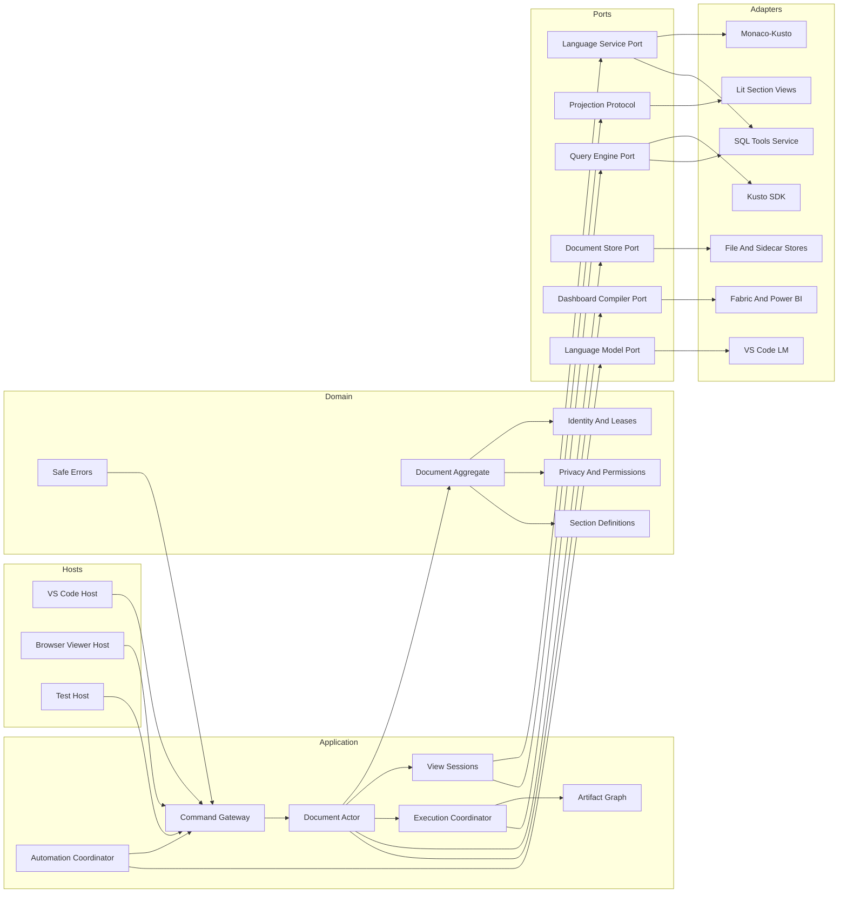

# Kusto Workbench Golden Outcome

## Purpose

This document is the architectural north star for Kusto Workbench. It answers one question:

> If every implemented product capability had been known on day one, how would the system be layered, orchestrated, and coordinated?

This is intentionally not a description of the current source tree. [ARCHITECTURE.md](ARCHITECTURE.md) describes the implementation that exists today. [ARCHITECTURE_CONVERGENCE.md](ARCHITECTURE_CONVERGENCE.md) is the living comparison and selects the next migration slice.

The golden outcome changes only when product behavior or a fundamental platform constraint changes. It is not rewritten to make the current implementation look closer to the target.

## Decision Summary

Kusto Workbench should be a **modular monolith with a serial actor per open document**, explicit application commands, immutable result artifacts, capability-based host adapters, and independently replaceable Kusto, SQL, Monaco, persistence, dashboard, and automation adapters.

The canonical application model is independent of VS Code, the DOM, Monaco, the Kusto SDK, SQL Tools Service, Fabric, and GitHub Copilot. In the VS Code product it runs in the extension host, where persistence, authentication, execution, and policy can be enforced. Notebook actors integrate through VS Code's `CustomDocument` lifecycle: the actor owns document content and application revisions, while VS Code owns the native dirty indicator, undo/redo stack, save, save-as, revert, backup, hot exit, and document-close orchestration. Plain-file compatibility sessions retain VS Code's `TextDocument` as the primary-text authority and coordinate a separate sidecar resource. The webview is a projection and command surface, not a second application authority. The browser extension composes the same codecs and projections with an explicitly read-only host instead of impersonating the VS Code message protocol.

This is not a microservice architecture and not a permanently event-sourced system. Documents remain versioned snapshots. Commands and events coordinate live behavior; they are not the durable file format.

## Product Invariants

The architecture may change freely, but these behaviors must survive.

### Documents And Sections

- Preserve `.kqlx`, `.sqlx`, `.mdx`, `.kql`, `.csl`, `.sql`, and supported `.md` behavior.
- Preserve the persistent no-file session and explicit user-file save semantics.
- Preserve Kusto, SQL, chart, transformation, markdown, Python, URL, HTML, and development-note sections.
- Preserve ordered sections, opaque file-scoped section IDs, names, collapse and resize state, diff indicators, and supported legacy fields.
- Preserve mixed Kusto and SQL sections in `.kqlx`. `.sqlx` permits SQL plus supported derived and presentation sections but no Kusto query sections. `.mdx` follows its explicit capability matrix. Invalid kinds are reported, never silently filtered.
- Preserve unknown root fields, state fields, known-section extension fields, unknown sections, and their order for forward-compatible round trips. A section ID must never encode its type or ownership.

### Kusto And SQL

- Preserve schema-aware editing, diagnostics, completion, formatting, execution, cancellation, timeouts, run modes, cache directives, comparisons, and result inspection.
- Preserve Kusto multi-account behavior, authority-sensitive physical connection identity, primary and supplemental schemas, background refresh, and interactive completion escalation.
- Preserve the single shared Monaco-Kusto worker constraint and exact recovery after an uncancelable timed-out mutation that physically settles. A permanently nonresponsive worker is poisoned and replaced through view recreation.
- Preserve SQL Tools Service discovery, language sessions, paging, execution, cancellation, verified lazy installation, process replacement, and document replay.
- A reused section ID or connection ID never grants authority to an older operation.

### Data And Derived Experiences

- Preserve virtualized result tables, filtering, sorting, search, selection, complex-value viewing, copy, and CSV export.
- Preserve charts, transformations, comparisons, HTML dashboards, dashboard slicers, and live refresh when an upstream result changes.
- Preserve bounded optional result persistence and exact restoration admission.
- Every source or derived output retains its producer identity, source revisions, sensitivity, trust requirements, completeness, and persistence/export/active-content permissions.

### Persistence And Compatibility Files

- The document model, not the DOM, is the persistence authority.
- Save, backup, revert, reload, close, and global-session autosave operate on coherent document revisions.
- Plain query files remain plain text. Sidecars remain validated, lock-protected, compare-and-swap safe, repairable, and multi-window aware.
- Metadata-only changes do not dirty a plain file when no adopted sidecar can store them.
- Restore never publishes stale results into a different section, target, principal, or privacy generation.

### Privacy, Identity, And Security

- Kusto Leave No Trace prevents source and derived data from entering durable storage while preserving query and visualization configuration.
- SQL Leave No Trace remains cross-window and fail-closed. It revokes shared language, schema, cache, persistence, Copilot, and retained-result access.
- Protected SQL manual operations use an isolated one-operation runtime and admit results only after process shutdown and sandbox deletion.
- Export and Power BI behavior follows artifact policy; protected sources cannot silently enter an Import model.
- Credentials and tokens never enter documents, webview messages that do not require them, prompts, or durable diagnostics.
- Cache and operation identity includes the physical target and principal, not only a saved connection ID.
- Document origin and trust are explicit policy inputs. Every document-authored privileged effect is admitted by one host policy authority using the exact document, origin, trust revision, command, and target. Transport authentication proves message provenance but never substitutes for authorization.
- Capabilities are independent and least-privileged. They include active scripts, artifact exposure, passive/explicit network access, local-code execution, Kusto execution, SQL/STS execution, language/schema network activity, model/tool use, external resource reads, external resource writes, raw active export, portable publication, and external navigation. Granting one never implies another.
- Remote and browser documents default to static rendering with no artifact, host execution, external resource, model/tool, or network capability. Local/workspace defaults are derived from VS Code workspace trust and explicit document decisions, never path appearance alone.
- Document-scoped network access covers authored HTML, URL sections, Markdown resources, automatic restore fetches, nested HTML/CSS/image/font/frame/media resources, authored form/navigation targets, Kusto/SQL/schema/model adapters, and future producers. Passive browser resource resolution cannot bypass the same policy that governs explicit host or script fetches.
- Document-authored file dependencies, including `linkedQueryPath` and relative Markdown resources, are canonicalized and admitted before read, open, edit, or write. Remote snapshots may automatically access only immutable companions listed in their source manifest and contained within that snapshot. Absolute paths, `file:` URIs, UNC paths, and traversal outside the manifest require explicit adoption and never auto-resolve.

### Automation, Dashboards, And Hosts

- Preserve per-section Kusto and SQL Copilot, optimization, tool execution, cancellation, and conversation management.
- Preserve agent tools that target explicit files and sections, including non-active open files.
- Preserve HTML dashboard provenance v1, preview bindings, Power BI validation, PBIR/TMDL generation, Import/DirectQuery behavior, and Fabric create/update publishing.
- Preserve the full VS Code host and read-only browser viewer. Unsupported browser capabilities are unavailable by contract, never silently simulated. Read-only does not imply trusted active content.
- Preserve first-launch setup, application editing preferences, walkthroughs, tutorials, remote-file opening, and agent-skill export.

## System Topology



## Layers And Dependency Rule

### 1. Domain Kernel

The kernel contains values and rules that remain valid without VS Code or a browser:

- Document and section identities.
- Document revision and section ordering.
- Section configuration schemas and migrations.
- Target, principal, policy, operation, and artifact identities.
- Privacy labels and allowed operations.
- Artifact lineage and dependency-cycle rules.
- Stable, sanitized error categories.

The kernel imports no VS Code, DOM, Monaco, Kusto SDK, STS, filesystem, Fabric, or language-model APIs.

### 2. Application Layer

The application layer coordinates use cases through explicit commands and serial owners:

- One `DocumentActor` per canonical document URI.
- One `ViewSession` per attached editor panel.
- Execution and schema coordinators.
- Artifact graph and derived-data scheduling.
- Persistence, export, publishing, and automation workflows.
- Profile-level connection, principal, privacy, and preference services.

Application services depend on domain types and ports. They do not know concrete SDKs or UI components.

### 3. Contracts And Ports

Contracts describe required capabilities:

- Versioned document and section codecs.
- Typed command, response, event, and projection envelopes.
- `QueryEngine`, `LanguageSession`, `DocumentStore`, `ArtifactStore`, `DashboardCompiler`, `Publisher`, and `LanguageModel` ports.
- Section-definition and section-view plugin contracts.
- Host capability declarations.

Runtime schemas validate all external input, including files, host messages, tool input, remote content, and browser payloads. TypeScript types are generated from or checked against those schemas.

### 4. Adapters

Adapters translate external systems into ports:

- VS Code custom documents, authentication, SecretStorage, commands, settings, and filesystem.
- Kusto SDK clients and account-partitioned schema caches.
- Monaco and Monaco-Kusto worker operations.
- SQL Tools Service JSON-RPC, downloader, process manager, and protected sandbox runtime.
- Fabric REST and Power BI project writers.
- GitHub Copilot Language Model API.
- Remote GitHub, Azure DevOps, SharePoint, and OneDrive sources.
- Browser-extension source providers and downloads.

Raw external errors and SDK types stop at the adapter boundary.

### 5. Presentation

Presentation renders projections and emits commands:

- Lit workbench shell and section views.
- Monaco editor adapters.
- Result table, chart, dialogs, tutorial surfaces, and connection views.
- Browser read-only rendering.

Presentation may own ephemeral interaction state such as an open menu, selection, scroll offset, and a Monaco view object. It does not own durable section configuration, execution authority, result lineage, privacy decisions, or document serialization.

Only composition roots may import concrete adapters and wire all layers together.

## Canonical Owners

| State or decision | Sole owner |
| --- | --- |
| Ordered sections, durable content, and application revision | `DocumentActor` and `DocumentAggregate` |
| Native dirty state, undo/redo, save, save-as, revert, backup, hot exit, document close | VS Code through `CustomDocumentAdapter`, coordinated with `DocumentActor` |
| Plain-file primary text and native edit history | VS Code `TextDocument` |
| Adopted sidecar revision, CAS base, dirty state, repair, and close disposition | Compatibility session and sidecar store |
| Panel attachment, focus, model leases, UI request correlation | `ViewSession` |
| Connections, secrets, principal preferences, privacy policy | Profile services |
| Query admission, replacement, cancellation, and terminal settlement | `ExecutionCoordinator` |
| Kusto schema target and worker readiness | Kusto schema coordinator behind engine/language ports |
| STS runtime, epochs, sessions, and replay | SQL runtime adapter |
| Output manifest, immutable revision, lineage, sensitivity, completeness, trust, permissions | `ArtifactStore` and `ArtifactGraph` |
| Transformation dependency scheduling | `ArtifactGraph` |
| Section persistence shape and migration | Registered `SectionDefinition` |
| DOM, Monaco instances, menus, transient selection | Section view plugin |
| Dashboard meaning and validation | Dashboard specification and compiler IR |
| Host support for commands | Host capability set |

There is never a second mutable mirror of canonical state on `window`, in the DOM, or in a component registry.

## Identity Model

Every asynchronous operation is admitted by structural identity, not timing or a friendly ID.

```text
DocumentSession
  documentId
  documentEpoch
  documentRevision
  origin
  trustRevision

SectionInstance
  documentId
  sectionId
  incarnation

TargetIntent
  sectionInstance
  targetGeneration
  engine
  requestedConnectionId
  requestedDatabase

ExecutionReservation
  targetIntent
  reservationSequence
  executionId

DispatchLease
  executionReservation
  connectionRevision
  endpointFingerprint
  principalFingerprint
  privacyRevision
  database
  dispatchAttempt

ArtifactIdentity
  producerOperationId
  artifactRevision
```

Rules:

1. Reservation happens synchronously before asynchronous preflight. A preflight terminal is correlated to the immutable reservation and does not invent a principal or physical target.
2. Immediately before each physical dispatch, the engine finalizes an immutable dispatch lease from the actual connection revision, endpoint, authenticated principal, privacy revision, and database.
3. A dispatched response is publishable only while both its reservation and dispatch lease are current.
4. Retargeting, reauthentication, privacy or trust change, section removal, document reload, or view disposal revokes affected reservations, dispatch leases, and active-content grants before publication.
5. Cancellation is correlated to one reservation or dispatch attempt, not every operation sharing a section ID.
6. Every accepted reservation produces at most one logical terminal outcome.
7. Logical timeout does not imply physical cancellation when an adapter cannot cancel.
8. Artifact exposure to active content is admitted independently from display, persistence, export, and model-use permissions.

## Document And View Coordination

### Document Actor

Each open notebook document has a serial mailbox. Commands include an ID, caller, expected revision where applicable, and typed payload. The actor validates and commits commands one at a time, then publishes immutable events and projections. A `CustomDocumentAdapter` reports each committed user edit to VS Code with matching undo and redo closures. Save, save-as, revert, backup, and hot-exit callbacks enter the actor mailbox and settle only for the exact revision requested by VS Code.

Representative commands:

- `AddSection`, `RemoveSection`, `MoveSection`, `PatchSection`.
- `BindTarget`, `RetireTarget`, `SetEditingPreference`.
- `RunQuery`, `CancelRun`, `RefreshSchema`.
- `ConfigureTransformation`, `ConfigureChart`, `ConfigureDashboard`.
- `Save`, `Backup`, `Revert`, `Reload`, `Close`.
- `ExportDashboard`, `PublishDashboard`.

Events are live coordination facts such as `SectionPatched`, `TargetBound`, `RunCompleted`, `ArtifactPublished`, and `PolicyRevoked`. The durable file remains a snapshot produced by codecs.

One actor exists per canonical URI within an extension host and may serve multiple views when VS Code enables `supportsMultipleEditorsPerDocument`. Its lifetime follows the VS Code custom document rather than any panel. Closing a view detaches only that view; closing the custom document drains the actor and disposes it. A restarted or separate-window extension host creates a new actor from the store and uses file versions, locks, CAS, and external-change notifications rather than assuming process-shared memory.

### View Session

A view attaches to a document actor and receives a complete initial projection followed by revisioned deltas. The view sends commands and never mutates the actor indirectly by serializing DOM state.

A view session owns:

- A unique session epoch.
- Section incarnations and editor/model attachments.
- Focus and viewport projection.
- Request/response correlation for UI-only operations.
- Capability negotiation and disposal.

Multiple views may attach to one document actor without creating competing document authorities. Each projection carries the actor revision it represents; stale view commands fail or are rebased by an explicit command policy.

### Document Host Modes

Notebook files use `CustomEditorProvider<CustomDocument>` semantics so the actor can own structured content while VS Code retains native editor lifecycle behavior. The adapter provides explicit undo/redo, save, save-as, revert, backup, hot-exit, and external-change handling.

Plain `.kql`, `.csl`, `.sql`, and supported `.md` compatibility files use a composite session:

- VS Code's `TextDocument` owns primary text, native version, undo, dirty state, save, and revert.
- The optional sidecar has an independent revision, dirty state, adoption/materialization state, CAS base, conflict state, recovery path, and close disposition.
- A primary save and sidecar publication are coordinated but never described as one atomic filesystem transaction. Deterministic recovery records which resource committed when the other fails.
- Metadata changes remain ephemeral while no adopted sidecar exists and therefore cannot dirty the primary text document.

## Section Plugin Model

Every section kind is registered once through two complementary contracts.

```typescript
interface SectionDefinition<State, Command> {
  readonly kind: string;
  parse(input: unknown): ParseResult<{ state: State; extensions: ExtensionBag }>;
  migrate(input: unknown): MigrationResult<{ state: State; extensions: ExtensionBag }>;
  serialize(state: State, extensions: ExtensionBag): unknown;
  validate(state: State, context: ValidationContext): ValidationIssue[];
  reduce(state: State, command: Command, context: SectionContext): SectionChange<State>;
  dependencies(state: State): SectionDependency[];
  artifactPolicy(state: State, context: PolicyContext): ArtifactPolicy;
  capabilities(state: State): SectionCapabilities;
}

interface SectionViewPlugin<ViewModel> {
  readonly kind: string;
  mount(host: HTMLElement, model: ViewModel, commands: CommandSink): SectionView;
}
```

The definition owns persisted meaning. The view owns rendering. Known-field serialization overlays canonical changes onto retained raw extension data. Root, state, and section codecs all carry extension bags; unknown sections remain opaque ordered entries. Editing one known field cannot erase data written by a newer producer.

The registry is closed-world and generated at build time. Adding a section updates one registry input; generation emits protocol schemas, file-schema registration, view registration, static tool contributions where required by VS Code, and capability metadata. It does not require hand-edited central save, restore, reorder, removal, tool, or privacy switches. Unknown section kinds are retained but are never activated as executable plugins.

## Execution And Artifact Model

Kusto and SQL share one transport-neutral execution state machine:

```text
reserved -> starting -> running -> cancelling -> cancelled
                                -> completed
                                -> failed
                                -> superseded
```

The coordinator:

1. Captures an exact synchronous execution reservation.
2. Revalidates policy and target and finalizes an immutable dispatch lease from the actual authentication context immediately before dispatch.
3. Cancels or supersedes the previous conflicting operation.
4. Uses the selected engine adapter.
5. Revalidates the reservation, dispatch lease, physical identity, principal, privacy, origin, and trust before admitting a terminal.
6. Publishes exactly one terminal and, on success, one immutable artifact revision.

A result is not mutable `latest result by box ID`. Every produced value has a durable manifest and a host-scoped payload handle:

```typescript
type PersistedArtifactRecord = TabularArtifactRecord | TextArtifactRecord |
  ImageArtifactRecord | PythonOutputArtifactRecord;

interface ArtifactRecordBase {
  id: ArtifactIdentity;
  producer: ProducerManifest;
  sourceArtifacts: readonly ArtifactIdentity[];
  sourceOrigin: DocumentOrigin;
  trustRevision: number;
  policyDecisionRevision: number;
  sensitivity: SensitivityLabel;
  completeness: 'complete' | 'truncated' | 'paged';
  createdAt: string;
  permissions: ArtifactPermissions;
  persistedPayload?: PersistedPayloadDescriptor;
}

interface TabularArtifactRecord extends ArtifactRecordBase {
  kind: 'tabular';
  schema: readonly ResultColumn[];
  rowCount?: number;
}

interface RuntimeArtifactBinding {
  record: PersistedArtifactRecord;
  payload: RevisionBoundPayloadHandle;
}

interface ArtifactPermissions {
  persist: boolean;
  export: boolean;
  sendToModel: boolean;
  publishImport: boolean;
  exposeToActiveContent: boolean;
}
```

`ProducerManifest` is stable across restart and records producer kind, source document/section revision, source origin, trust revision, physical target identity where applicable, principal fingerprint, privacy generation, policy-decision revision, and operation ID. It does not rely on a still-live operation lease to validate restored data.

The persisted record never embeds a process-local handle. On restore, the `ArtifactStore` first revalidates origin, trust, target, principal, privacy, and policy revisions, then rebinds an allowed persisted payload descriptor to a new runtime handle. A trust or origin change revokes the binding and recomputes `exposeToActiveContent` before any renderer receives data.

Before the full artifact store exists, any compatibility adapter exposing current results to active content must carry an immutable, host-issued source-admission stamp containing producer/result revision, source target and principal where applicable, privacy-decision revision, and derived lineage. Missing or stale stamps fail closed. A view must never infer active-content safety from the section's current connection after a result was produced.

The `ArtifactStore` defines handle scope, revision-bound page reads, consistency, eviction, pinning, backpressure, and cross-view access. A page token is valid only for one artifact revision. Full-data sort, search, copy, export, and transformation explicitly declare whether they require a complete artifact, a server-side operation, or may operate on the loaded window. Each host supplies an appropriate store: memory and bounded persisted snapshots in VS Code, embedded snapshot readers for offline/browser documents, and deterministic in-memory stores for tests.

Kusto and SQL queries, URL/CSV loads, Python output, transformations, and other producers publish the appropriate manifest kind. Charts, transformations, comparisons, dashboards, persistence, exports, and Copilot consume an explicit artifact revision. The artifact graph rejects dependency cycles and invalidates derived artifacts when an upstream revision changes. UI projections may page or cache artifact data, but they cannot erase lineage or permissions.

## Kusto Coordination

The Kusto engine owns client pooling, physical connection identity, account partition, execution, and schema repositories. The language adapter owns Monaco integration.

The shared Monaco-Kusto worker remains a special serialized resource:

- Every worker mutation passes through one transaction port.
- A transaction commits only after its physical call succeeds.
- A logical timeout revokes commit authority but retains the queue slot until physical settlement.
- When the physical call settles, inline authoritative-primary recovery completes before a later mutation starts.
- A hard watchdog marks a permanently nonresponsive worker as poisoned, revokes all readiness derived from it, and requests view/worker recreation. The recreated view rehydrates models from document and schema authorities rather than trusting the abandoned worker.
- Primary readiness and supplemental-schema enrichment remain separate.
- Background schema work cannot prompt; explicit completion may escalate interactively.
- Section/model/target/operation leases guard every publication.

The custom KQL analyzer is an adapter behind a language-analysis port and can evolve independently of document, execution, and UI orchestration.

## SQL Coordination

The SQL engine implements the same execution and artifact contracts while retaining SQL-specific machinery:

- Dialect metadata and MSSQL implementation.
- Verified lazy STS installation.
- Process epochs, replacement, and restart replay.
- Editor-scoped language documents and extension-scoped data operations.
- SQL Login secrets in SecretStorage and Entra principal fingerprints.
- Protected one-operation runtime for Leave No Trace database discovery and manual execution.

SQL-specific requirements do not leak into generic document or result components. Generic execution behavior does not get reimplemented in SQL controllers.

## Persistence And Sidecars

`DocumentStore` receives a coherent aggregate snapshot at a known application revision through the VS Code custom-document lifecycle. Section definitions serialize their own domain state. Artifact policy decides whether a persisted artifact record or bounded payload may enter the snapshot.

The document state machine is:

```text
loading -> clean <-> dirty -> saving -> clean
                    |          |
                    |          -> dirty on failure
                    -> conflicted/reloading
```

The actor's application state follows these transitions, while VS Code remains authoritative for the native dirty indicator and invokes save/revert/backup/close operations. Close waits on a flush barrier. External changes use explicit conflict/reload transitions. Restore creates domain state before views and does not emit mutation commands merely because controls initialize.

Plain-file compatibility uses anti-corruption adapters around the same document actor:

- Primary text is authoritative for the query or markdown body.
- Sidecar codecs own only metadata and additional sections. The sidecar independently transitions through `absent`, `ephemeral`, `adopted-clean`, `adopted-dirty`, `publishing`, `conflicted`, and `recovery-required`.
- Store/session abstractions retain lock, CAS, repair, recovery, revision, and close-drain behavior.
- Partial primary/sidecar save failure records the committed resource and exact recovery action; it never reports the pair as atomically saved.
- Language-specific providers contribute only primary-text editing and user-facing adoption behavior.

## Protocol And Startup

There is one versioned protocol package for both directions. Every envelope carries:

- Protocol version and channel.
- Document and view-session identity.
- Command, request, or event ID.
- Correlation and causation IDs.
- Expected or produced revision where relevant.
- Runtime-validated payload.

Host protocol ingress is authenticated by the transport and bound to the current view session. The application never treats arbitrary `window.message` events as host messages. Bootstrap buffering applies the same admission rule as the runtime dispatcher. Child frames communicate through separate source-bound channels with narrow runtime-validated message types; they cannot send document, trust, result, persistence, tool, or host-control envelopes.

After ingress validation, the command gateway authorizes every privileged effect against the current document capability revision before invoking an adapter and again before admitting data or a terminal. Automatic restore work, keyboard actions, Copilot/tool workflows, hidden/offscreen renderers, language/schema preparation, and direct UI commands all use this gateway. Revocation cancels cancellable work, retires uncancellable leases, closes prohibited STS/language sessions, tears down active renderers, and rejects late publication.

Startup is an explicit handshake:

1. The host creates a view session and declares capabilities.
2. The UI registers section-view plugins and reports ready.
3. The host sends one complete initial projection.
4. Buffered pre-ready commands are replayed once, in order.
5. Revisioned deltas begin only after the initial projection is acknowledged.

No correctness depends on script import order, temporary `window.message` listeners, or independently mirrored pending-command objects. Large artifacts use handles and paging rather than oversized control messages.

## Host Composition

### VS Code Composition Root

The extension root owns profile services, engines, stores, tools, and registrations. A document root creates or reuses the actor for one canonical URI. A view root attaches a panel and presentation protocol to that actor.

Agent tools and integrated Copilot call application commands directly with captured document, section, target, and operation identities. They do not drive the product by synthesizing webview messages or relying on whichever editor later becomes active.

### Browser Composition Root

The browser root uses the same document codecs, section definitions, artifact readers, trust policy, policy-owned resource resolver, and projection models with a capability set such as:

```text
readDocument = true
editDocument = false
executeQuery = false
authenticate = false
persist = false
downloadDerivedFile = true
activeContent = false
```

The viewer never simulates VS Code responses, patches persistence functions, or repeatedly enforces read-only state with timers. Remote/browser documents render dashboard active content and external Markdown/URL resources statically unless an explicit trusted-host policy enables them. Sandboxes cannot receive artifacts without `exposeToActiveContent` permission. All external resource and navigation URLs are removed, blocked by CSP, or resolved through the policy-owned resource service; assigning a raw external URL in a renderer is not an authority decision.

### Test Composition Root

The test host supplies deterministic clocks, IDs, stores, engines, policies, and transport. State machines and cross-layer journeys run without VS Code or a real DOM. Adapter and native-interaction tests remain separate.

## Dashboard And Automation Architecture

Dashboard architecture has two explicit layers:

- A portable provenance specification and compiler IR defines the subset shared by preview, standalone HTML, PBIR/TMDL/DAX generation, and Fabric publishing. Binding, slicer, ordering, formatting, and policy semantics are shared across these renderers.
- An active-content source extension preserves arbitrary authored HTML/JavaScript behavior that cannot be represented in Power BI. It carries origin/trust requirements, active-content artifact permissions, sandbox/CSP/network policy, and validation warnings that identify non-portable behavior. It is used by trusted preview and by the explicit raw standalone HTML export.

Power BI and Fabric export never claim parity for active-content code. They compile only the portable IR and report unsupported behavior before publication. Standalone HTML export remains a distinct active-content export that preserves authored code; it requires an explicit export decision, records or displays its origin/trust implications, and applies the selected standalone CSP/network policy rather than masquerading as a portable renderer.

Automation has two layers:

- Workflow services compose document and execution commands for Copilot and tools.
- LM and tool adapters translate VS Code APIs into those workflows.

Every automation operation captures its target before asynchronous work, can be cancelled, emits a correlated terminal, and respects artifact permissions before sending data or schema context to a model.

## Errors And Observability

All failures cross application boundaries as a discriminated `WorkbenchError`:

```typescript
interface WorkbenchError {
  code: string;
  category: 'validation' | 'authentication' | 'authorization' | 'network' |
    'execution' | 'timeout' | 'cancelled' | 'conflict' | 'policy' | 'internal';
  retryable: boolean;
  userMessage: string;
  recoveryActions: readonly RecoveryAction[];
  correlationId: string;
  safeTechnicalDetails?: Readonly<Record<string, unknown>>;
}
```

Cancellation and supersession are normal terminal outcomes, not generic failures. Only adapters see raw backend errors.

Structured traces record state transitions, stale-response rejection, cache outcomes, worker recovery, STS epochs, persistence CAS, protocol latency, and export phases. Logging sinks hash identities and prohibit credentials, tokens, query text, raw schemas, results, and protected backend messages.

## Suggested Logical Layout

The boundaries matter more than whether they are separate npm packages. A from-scratch layout could be:

```text
packages/
  kernel/
    document/
    identity/
    artifacts/
    privacy/
    errors/
  application/
    documents/
    views/
    execution/
    schema/
    dataflow/
    automation/
  contracts/
    files/
    protocol/
    sections/
    engines/
    hosts/
  engines/
    kusto/
    sql/
  dashboard/
    provenance/
    compiler/
    renderers/
  adapters/
    vscode/
    filesystem/
    kusto-sdk/
    monaco-kusto/
    sts/
    fabric/
    copilot/
    remote-sources/
  presentation/
    workbench/
    section-views/
    components/
  hosts/
    vscode-extension/
    browser-extension/
    test-host/
```

During migration these may be folders inside the existing build. Package extraction is justified only when dependency enforcement or independent build/runtime needs make it valuable.

## Activation And Deployment

The extension composition root has explicit `activating`, `partially-ready`, `ready`, `deactivating`, and `disposed` states. Profile services start independently where possible; failure or slow startup of STS, Copilot, tutorials, or one adapter does not disable unrelated Kusto/document capabilities. Actor and view registries drain on deactivation, cancel operations, settle persistence barriers, stop child processes, and dispose subscriptions in dependency order. Extension-host restart reconstructs actors and adapters from durable stores rather than assuming process continuity.

The current platform packaging remains a migration constraint unless the host loading model is deliberately changed and validated:

- VS Code extension host output remains CommonJS.
- The webview remains an IIFE loaded by a script tag.
- Monaco and Monaco-Kusto remain copied AMD assets, not bundled imports.
- The webview remains unsplit while using IIFE output.
- Static VS Code tool contributions are generated at build time from the closed-world registry.
- The browser extension build consumes the supported shared artifacts and runs its own package/size/tests.

These formats are adapters and deployment choices, not domain concepts, but the golden implementation must honor them while targeting the current VS Code and browser platforms.

## Enforced Dependency Rules

Architecture checks should reject:

- Domain or application imports from VS Code, DOM, Monaco, SDK, STS, Fabric, or LM implementations.
- Section-to-section DOM reads or calls.
- Direct document writes outside `DocumentStore`.
- Direct result mutation outside `ArtifactStore`.
- Execution terminals without exact operation identity.
- Protocol messages without registered runtime schemas.
- New ambient window globals outside an explicit legacy/external adapter allowlist.
- Type inference from section ID prefixes.
- SDK types crossing adapter boundaries.
- Privacy-sensitive data publication without an artifact-policy decision.

## Test Architecture

- Pure and property tests for codecs, reducers, identity admission, policy joins, artifact lineage, and cycle detection.
- Model-based fake-time tests for document, execution, schema, worker, STS, and privacy state machines.
- Contract tests for every section definition, section view, query engine, host capability set, and protocol schema.
- Golden legacy-file, sidecar, dashboard, PBIR/TMDL, and DAX fixtures.
- Cross-layer tests using the test composition root for run/cancel, restore/save, policy revoke, schema refresh, and derived-data refresh.
- Adapter tests for VS Code, Kusto SDK, STS, Fabric, remote sources, and browser acquisition.
- Native VS Code E2E for authentication, Monaco, pointer geometry, and host integration.
- Browser Playwright and visual tests for read-only rendering and downloads.
- Privacy leakage scans, process-crash failpoints, bundle gates, and forbidden-import checks.

## Definition Of The Golden Outcome

The migration has reached this outcome when all of the following are true:

1. A document actor is the sole application content/revision authority, integrated with VS Code's native custom-document lifecycle; compatibility primary text remains owned by `TextDocument`.
2. Every section kind is supplied by a registered definition and view plugin.
3. Every asynchronous response and terminal carries exact structural identity.
4. Kusto and SQL use one execution contract and all producers publish immutable artifact records through bounded host stores.
5. Derived sections consume artifact revisions with retained lineage, completeness, trust, and permissions.
6. Persistence, export, Copilot, and publishing operate on domain state and artifacts, never DOM snapshots.
7. Host/webview communication is one runtime-validated, versioned protocol.
8. The browser viewer is a real read-only composition root.
9. `QueryEditorProvider`, the central webview message switch, mutable window state, and ID-prefix ownership are gone.
10. Architecture tests make these boundaries harder to regress than to follow.

The product may still contain large algorithms or sophisticated adapters. The goal is not small files. The goal is one clear owner for every state transition and one explicit contract at every external boundary.