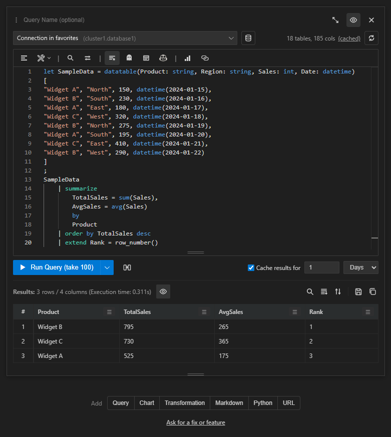
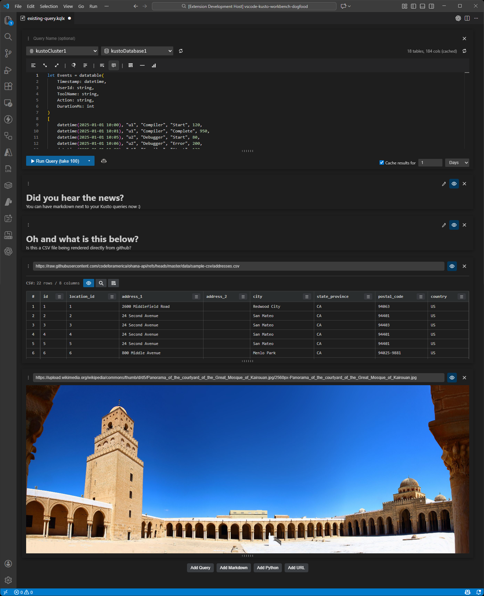
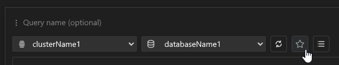

# Kusto Workbench

A modern, notebook-like workflow for Kusto Query Language (KQL) in VS Code.

Kusto Workbench is built for the tight loop of writing queries, running them, inspecting results, and iterating quickly—without forcing you to abandon existing `.kql` / `.csl` files.

## Screenshots

### Modern editor with a bunch of features

### Support for Kusto, CSV, Images, Markdown, Python

### Favorites

## Key features

- Just a better all around Kusto query editor with smart auto-complete (not AI based), Kusto documentation integration as you type, smart prettify query functionality, and a bunch of other features for you to discover. 

- Built-in Kusto query caching support to reduce repeated round-trips while iterating. Not only does it make your inner loop faster, but your admin will also love you.

- Kusto query result exploration: search across results, JSON/object viewer, per-column analysis (unique values, distinct counts), table sorting (including multi-column sorting), and table filtering (value-based and rule-based).

- Notebook-style sections when saving using the file extension `.kqlx`: Query + Markdown + Python + URL preview for now, but more to come.

- You can hide / show query sections (similar to URL sections) to keep long notebooks manageable.

- Diagnostics: red squiggles and context-aware auto-complete (multi-line aware and variable aware) that aligns with diagnostics behavior.

- Favorites: save cluster + database pairs in your VS Code profile, then quickly switch the editor to a favorite connection.

- Automatically improve query performance using GitHub Copilot, with side-by-side comparison tools to make sure the before and the after produce the same results and actually save query execution time.

## Quick start

1. Open the Command Palette (`Ctrl+Shift+P`).
2. Run `Kusto Workbench: Open Query Editor`.
3. Add a connection, pick a database, and run a query.

To open an existing file:

- `.kqlx`: open it normally, or run `Kusto Workbench: Open .kqlx File`
- `.kql` / `.csl`: open it normally (opens in compatibility mode)

## Query optimization (Copilot)

Use the query toolbar to optimize the current query with GitHub Copilot.

The optimization workflow is designed to be safe and practical:

- Copilot proposes a performance-improved query while preserving results
- A comparison section can be created to run both queries and compare outputs
- When results match, you can accept the optimizations back into the original query

Notes:

- Copilot optimization requires GitHub Copilot to be available in VS Code
- The prompt is intentionally strict about preserving semantics

## Drag & drop section reordering

In `.kqlx` files, each section has a drag handle. Drag sections to reorder your notebook.

## Prettify query

Use the query toolbar “Prettify” action to apply Kusto-aware formatting rules (for example, improving layout around common operators such as `where` and `summarize`).

## Diagnostics and debugging

When a query fails, Kusto Workbench surfaces helpful, human-friendly diagnostics.

Where possible, diagnostics include:

- Go-to-line behavior to take you straight to the relevant part of the query
- Highlighting of important terms to focus your attention

## File formats (and “no file” mode)

### Open existing `.kql` and `.csl` files (compatibility mode)

You can open existing `.kql` and `.csl` files with no conversion. The file stays plain text, and saving writes back plain text.

Compatibility mode is intentionally limited to a single query section (it does not persist notebook-only content like Markdown/Python into a `.kql`/`.csl` file), but you still get the modern editor experience and result tooling.

### Use the new `.kqlx` format for full features

For the full notebook-style experience, use `.kqlx` files. `.kqlx` supports multiple sections:

- Query sections (KQL)
- Markdown sections
- Python sections (run locally)
- URL preview sections

### Start without a file (persistent global session)

You don’t need to create a file.

Run `Kusto Workbench: Open Query Editor` and the extension opens a global, persistent session that auto-saves to a `.kqlx` file stored in VS Code’s global storage. This session is designed to survive VS Code restarts.

If you want to turn that session into a real file in your workspace later, use `Kusto Workbench: Save Session As... (.kqlx)`.

## Commands

- `Kusto Workbench: Open Query Editor`
- `Kusto Workbench: Open .kqlx File`
- `Kusto Workbench: Save Session As... (.kqlx)`
- `Kusto Workbench: Manage Connections`
- `Kusto Workbench: Delete All Connections`

## Importing connections from Kusto Explorer (connections.xml)

This extension can import connections that you already have set up in the Windows Kusto Explorer desktop app.

1. In Kusto Explorer, export your saved connections as an XML file (commonly named `connections.xml`).
2. In VS Code, open the query editor and choose `Import from .xml file…` in the connection picker.

## Requirements

- VS Code 1.107.0 or higher
- For Python sections: a local Python install available as `python`, `python3`, or `py` on your PATH

## Data & privacy (how it actually works)

This extension is designed to keep your work local by default, and only sends data to remote services when you explicitly run an action (run a query, optimize with Copilot, etc.).

### What gets stored locally

- **Connections**: Saved in VS Code extension global state on your machine (name + cluster URL + optional default database). This is not synced by the extension itself, but your VS Code settings/profile sync behavior may vary.
- **`.kqlx` notebooks**: Stored wherever you save them (workspace file), and contain your section content (queries, markdown text, python code/output, URL section settings, etc.).
- **Persistent “no file” session**: If you use `Kusto Workbench: Open Query Editor`, the session auto-saves to a `.kqlx` file in VS Code’s *global storage* for this extension so it can survive restarts.
- **Optional persisted query results**: When enabled/available, the extension may embed recent query results into the `.kqlx` state as JSON (capped at ~200KB per section). If you save a `.kqlx`, those embedded results become part of the file.
- **In-memory caches**: Database lists and schema information are cached in memory to speed up iteration. These caches expire and are not intended to be long-term storage.

### What gets sent to your Kusto cluster

When you click **Run** (or any action that executes KQL), the extension sends:

- Your **query text**
- The target **cluster** and **database**
- Your **Microsoft access token** (obtained via VS Code’s built-in Microsoft authentication)

The extension uses `vscode.authentication.getSession('microsoft', ['https://kusto.kusto.windows.net/.default'], …)` to acquire a token. Token lifecycle and secure storage are handled by VS Code; the extension uses the token in memory to authenticate requests.

### What gets sent to GitHub Copilot

When you use **Optimize query performance**:

- The extension sends the optimization prompt (which includes your **query text**) to GitHub Copilot via VS Code’s Language Model API (`vscode.lm`).
- The extension does **not** send your Kusto credentials to Copilot.
- Any result comparison happens by running queries against your Kusto cluster (not by executing anything inside Copilot).

Important note: the prompt can be edited in the UI; anything you include there is part of what gets sent to Copilot.

### Python sections

Python sections run **locally** on your machine by spawning a local Python interpreter (`python`, `python3`, or `py`).

- Your code is executed locally.
- Output is captured (with size limits) and may be stored in the `.kqlx` file if you save.

### Diagnostics and logs

- Query errors returned by the Kusto SDK/cluster may be surfaced in the UI (and may include fragments of your query or server-provided diagnostics).
- The extension may write diagnostic information to the VS Code Developer Tools console during development/troubleshooting.

### How to remove stored data

- Remove saved connections: use `Kusto Workbench: Manage Connections`.
- Remove `.kqlx` content (including embedded results): delete or edit the `.kqlx` file.
- Clear the persistent session: delete the extension’s global storage for Kusto Workbench (this removes the auto-saved session file).

## License

[MIT](LICENSE)
