# Kusto Workbench

A modern, notebook-like workflow for Kusto Query Language (KQL) in VS Code.

Kusto Workbench is built for the tight loop of writing queries, running them, inspecting results, and iterating quickly; without forcing you to abandon existing `.kql` / `.csl` files. It uses the official Microsoft Kusto editor ([GitHub](https://github.com/Azure/monaco-kusto)) so you will always have a reliable and robust Kusto editing experience and you'll get extra goodies on top that you won't get in the official clients (web or desktop).

It has many power features that accelerate the experts, and empower the newbies. You can search and view results, including complex JSON columns. You can transform data without changing queries. You can create charts and graphs with just a few clicks. You can compare two queries in terms of performance and results to make performance improvements with confidence. All this is just scratching the surface as there is so much more for you to be pleasantly surprised by.

Copilot integration gives your favorite LLM the right context and tools to actually write smart Kusto queries, the type of Kusto queries an expert would write. It can execute its own queries and perform its own checks before giving you a response, drastically improving the quality of the response.

It has advanced markdown capabilities (thanks to the amazing folks at [TOAST UI](https://ui.toast.com/)), so you could even just use it as a better markdown editor (with WYSIWYG support) for VS Code. Open existing .md files (open with, or change association), or make a new empty .mdx file and give it a go.

### Walkthroughs

New to the extension? Two built-in walkthroughs will get you going fast:

* **Agent-First Workflow** – Let the VS Code Copilot agent build queries, charts, and full reports for you.
* **Editor-First Workflow** – Write KQL yourself, explore results, then add charts and markdown around them.

Open them from the command palette (`Kusto Workbench: Open Walkthroughs...`) or from the Activity Bar.

## Key Features

It is not really possible to cover every single feature here with a screenshot and an explanation. Hopefully most of the functionality is intuitive, and easy to discover organically. If you are lacking any functionality or you think something isn't working correctly, just please don't hesitate to reach out, **I will get it done for you!**

### Activity Bar

Click the icon in the Activity Bar for a bunch of helpful shortcuts.

All of this is also available through the VS Code command palette, so if you prefer a more minimal look, you can turn off the Activity Bar icon in the extension's settings.

### Import connections

Don't manually add every single Kusto cluster and database you work with. If you have been using Kusto either on the desktop or browser already, just import your existing connections.

1. In Kusto Explorer, export your saved connections as an XML file (commonly named `connections.xml`).
2. In VS Code, open the query editor and choose `Import from .xml file…` in the connection picker.

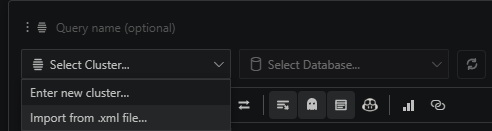

### Save connections to favorites

Save frequently used connections to favorites, with a friendly name so you can remind yourself what the connection is used for.

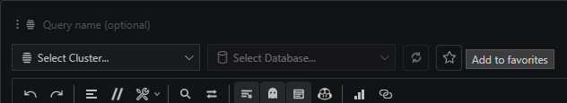

### VS Code custom agent that actually works

Just let the custom VS Code agent 'Kusto Workbench' do all your work. It's crazy how good this thing is. If you are having problems, make sure you have a really good model like Claude Opus 4.6 selected. If it still doesn't work, report the issue and I'll fix it for you. I use this every day, if it doesn't work for you, just tell me!

The agent can:

* Create and configure query, markdown, chart, transformation, and Python sections
* Execute queries and inspect results
* Search across all your cached schemas to find tables and columns
* Fetch schemas live from clusters it hasn't seen before
* Orchestrate multi-section reports end to end
* Use a dedicated sub-agent for deep Kusto data searches

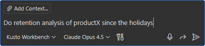

### Let your own agent control Kusto Workbench

Export a skill that teaches your own agent how to control Kusto Workbench and its advanced features

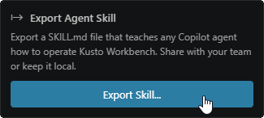

### Integrated Copilot Chat (per section)

Each Kusto query section has its own Copilot Chat window built right in. Click the Copilot button in the query toolbar to open it. The LLM knows your database schema, can execute queries to validate its suggestions, and has full conversation history so you can iterate naturally. You manage the conversation history directly in the UI, remove stale tool calls, clear the whole chat, or just keep going. Use this when working inside a very specific section of the overall workbook, to make surgical changes, not to build a new workbook from scratch; use the custom Kusto Workbench agent via the VS Code chat window for that instead.

### Modern Kusto editor using the official bits from Microsoft

Uses the official Microsoft Kusto editor ([GitHub](https://github.com/Azure/monaco-kusto)) so you will always have a reliable and robust Kusto editing experience and you'll get extra goodies on top that you won't get in the official clients (web or desktop).

### Load .csv data directly from the internet

* If you have a URL, then you can load it.
* Supports image files like .png and .jpg and all sorts of orientations and sizing options.
* Supports .csv files with access to all the tabular controls and tools like search, scroll to column, etc.
* You can transform .csv files just like you can transform Kusto query results, and you can join them all too!

### Transform data

* You can transform Kusto query results without changing the query itself.
* Derive new columns, summarize and aggregate, get distinct values, or pivot your data and all without writing another line of KQL.
* Transformations also work on .csv files loaded via a URL section.

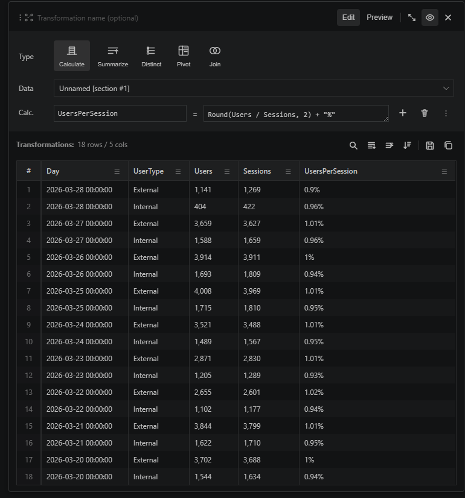

### Chart data

* Create charts from Kusto query results or .csv data.
* Supports line, area, bar, scatter, pie, sankey, and funnel chart types (more to come).
* Configure axes, legends, data labels, and more.
* Click on the X, Y, Legend labels to configure additional settings.
* Charts update live when you re-run your query.

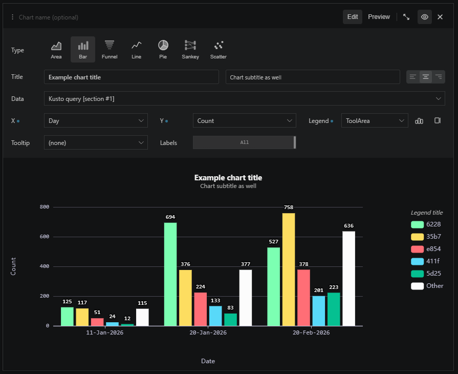

### Prettify query

Use the query toolbar "Prettify" action to apply Kusto-aware formatting rules (for example, improving layout around common operators such as `where` and `summarize`).

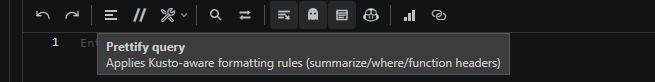

### Diagnostics and debugging

When a query fails, Kusto Workbench surfaces helpful, human-friendly diagnostics:

* Go-to-line behavior to take you straight to the relevant part of the query
* Highlighting of important terms to focus your attention with red squiggles
* Hints in the scrollbar

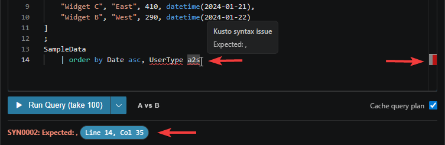

### Query comparison and performance optimization

If you have an existing query that you want to improve without changing its behavior and the results it returns, you can use the built-in functionality to compare its performance and to guarantee that the data returned is identical, even if the rows and columns might be out of order.

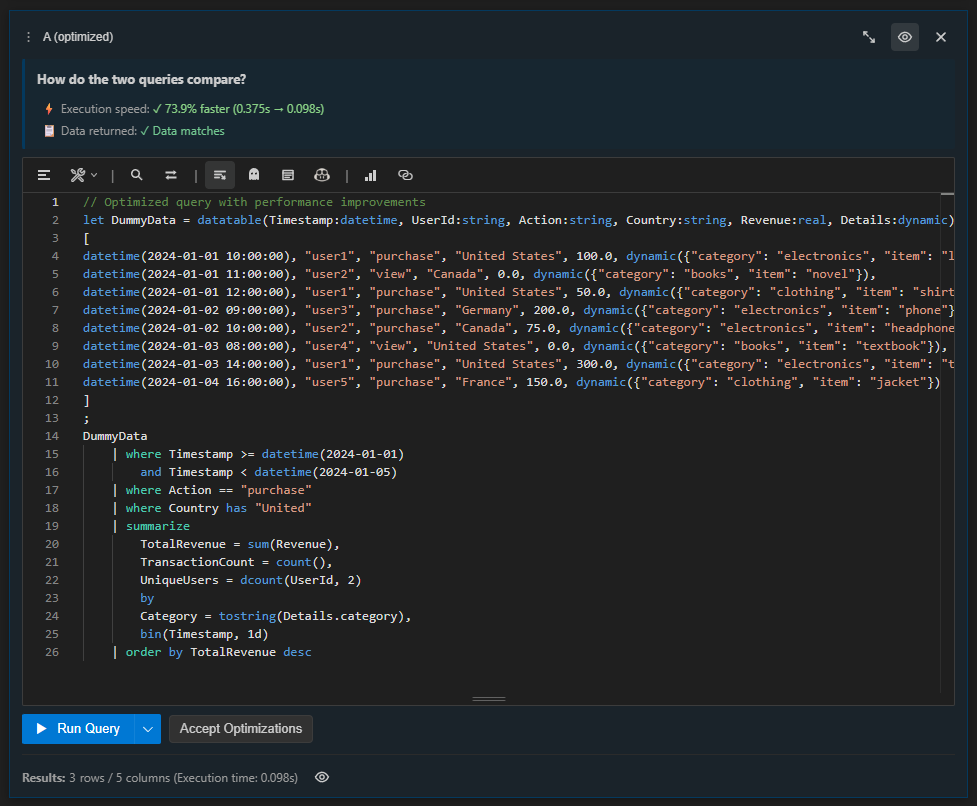

### Share to Teams and Azure Data Explorer

Share a query as an Azure Data Explorer link with a single click. When sharing entire sections, the content pastes nicely into Teams and other rich editors.

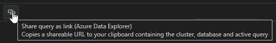

### Multi-account support

Sometimes we need to authenticate to different Kusto clusters with different identities, and this extension not only supports this scenario, but allows it even within a single file.

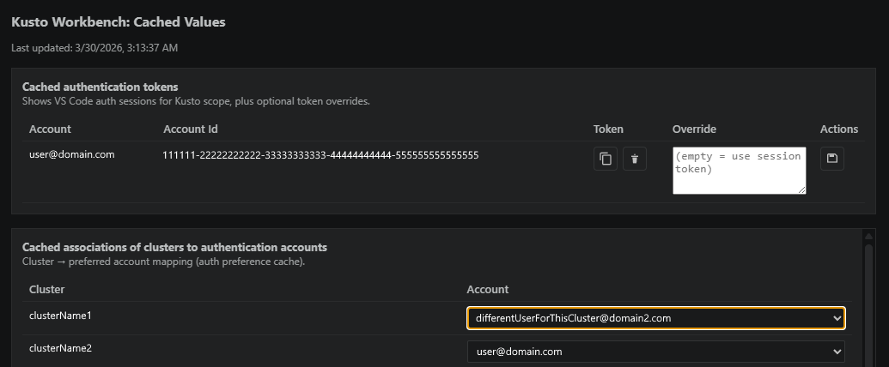

### Connection Manager and Cluster Explorer

Explore the Kusto clusters you have added connections to with ease. Browse the tables, functions and their definitions. Create new `.kqlx` files with the connection details for a database already prefilled, ready to go.

### Leave No Trace

Are you connecting to a Kusto cluster for which you should never export data or save data locally due to access restrictions, legal requirements, etc? Just flag the cluster and the extension will never save any of its data to disk, or even in temporary files. It will still allow you to save the queries and the chart settings, but the data itself will have to be retrieved each time you connect to the cluster.

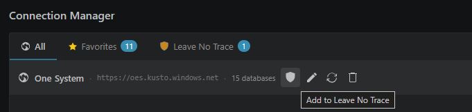

### Markdown sections

Full WYSIWYG and raw markdown editing powered by TOAST UI Editor. Add narrative text, documentation, and headings around your queries and charts to build complete reports.

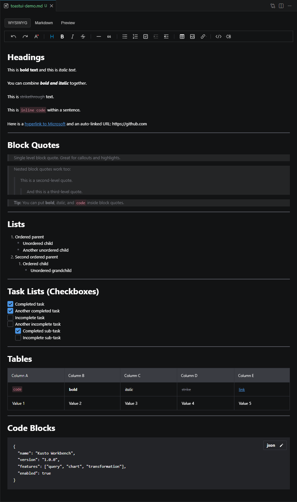

### Python sections

* Embed Python code cells alongside your KQL.
* Python runs locally on your machine, and output is captured inline.
* Great for post-processing query results or running custom analysis.
* P.S. Very soon it will be possible to connect the Python sections to all the other sections automagically, stay tuned :)

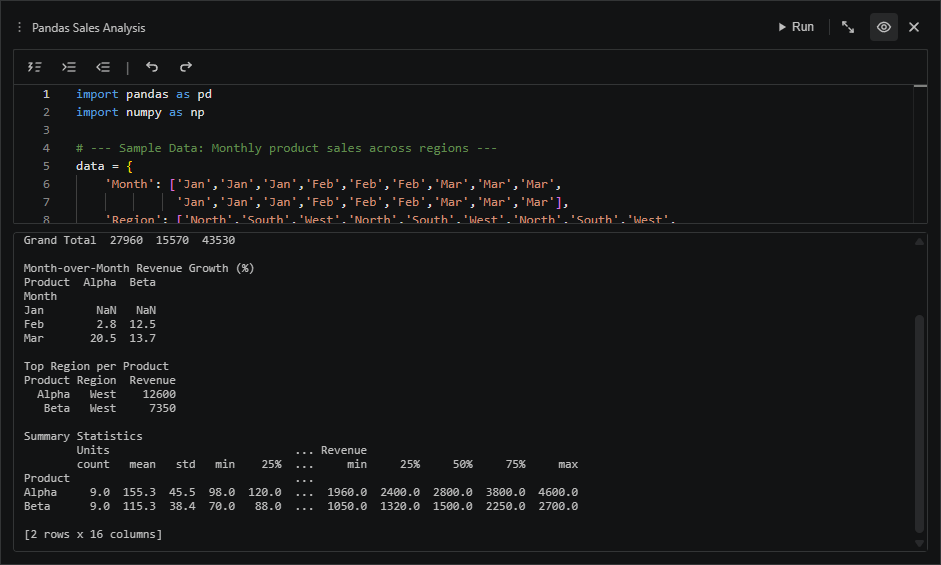

### Search results

Search within query results using simple wildcards or full regex.

### Open Remote Files

Open `.kqlx` files directly from GitHub or SharePoint using sharing or raw URLs. No need to download first.

### Development Notes

The Copilot agent can store development notes per file (corrections, schema hints, gotchas) that persist across sessions and improve AI-assisted workflows over time. View them with `Kusto Workbench: Show Development Notes`.

## Quick start

1. Open the Command Palette (`Ctrl+Shift+P`).
2. Run `Kusto Workbench: Open Query Editor`.
3. Add a connection, pick a database, and run a query.

**Keyboard shortcut:** `Ctrl+Shift+Alt+K` (`Cmd+Shift+Alt+K` on macOS) opens the Query Editor directly.

To open a file:

* `.kql` / `.csl`: open it normally (opens in compatibility mode)
* `.kqlx`: create an empty file and open it normally, or run `Kusto Workbench: Open .kqlx File`
* `.mdx`: create an empty file and open it normally

## File formats (and "no file" mode)

### Open existing `.kql` and `.csl` files

You can open existing `.kql` and `.csl` files with no conversion. The file stays plain text, and saving writes back plain text. If you add more stuff to these types of files, you are asked to save a `.json` file with the same filename side-by-side.

### Create `.kqlx` files for convenience

Use `.kqlx` and `.mdx` files to keep everything in a single file (`.kql` and `.csl` files require a sidecar `.json` file for some of the functionality).

### "No file" mode (persistent global session)

You don't need to create a file to use the extension. Run `Kusto Workbench: Open Query Editor` and the extension opens a global, persistent session that auto-saves to a `.kqlx` file stored in VS Code's global storage. This session is designed to survive VS Code restarts. If you want to turn that session into a real file in your workspace later, use `Kusto Workbench: Save Session As... (.kqlx)`.

### Open Remote File

You can open files directly from GitHub or SharePoint using sharing or raw URLs using `Kusto Workbench: Open Remote File` from the command palette or from the Quick Access panel off the Activity Bar icon.

## Commands

| Command | Description |
| ------- | ----------- |
| `Kusto Workbench: Open Query Editor` | Open the global persistent session |
| `Kusto Workbench: Open Remote File` | Open a `.kqlx` file from a GitHub or SharePoint URL |
| `Kusto Workbench: Open .kqlx File` | Create or open a `.kqlx` notebook |
| `Kusto Workbench: Open .mdx File` | Create or open an `.mdx` notebook |
| `Kusto Workbench: Save Session As... (.kqlx)` | Save the current session to a file |
| `Kusto Workbench: Manage Connections` | Open the Connection Manager |
| `Kusto Workbench: Delete All Connections` | Remove all saved connections |
| `Kusto Workbench: Show Cached Values` | Inspect cached auth tokens, databases, etc. |
| `Kusto Workbench: Reset Copilot Model Selection` | Reset the sticky model choice for integrated Copilot Chat |
| `Kusto Workbench: Open Walkthroughs...` | Launch the built-in guided walkthroughs |
| `Kusto Workbench: Open Kusto Workbench Custom Agent` | Open the Copilot Chat panel with the Kusto Workbench agent |
| `Kusto Workbench: Export Agent Skill...` | Export a SKILL.md file so other Copilot agents can use Kusto Workbench as a tool |
| `Kusto Workbench: Show Development Notes` | View AI development notes stored in the current file |

## Requirements

* VS Code 1.107.0 or higher
* For Python sections: a local Python install available as `python`, `python3`, or `py` on your PATH

## Data & privacy (how it actually works)

This extension is designed to keep your work local by default, and only sends data to remote services when you explicitly run an action (run a query, optimize with Copilot, etc.).

### What gets stored locally

* **Connections**: Saved in VS Code extension global state on your machine (name + cluster URL + optional default database). This is not synced by the extension itself, but your VS Code settings/profile sync behavior may vary.
* **Authentication account preferences (per cluster)**: The extension remembers which Microsoft work account was last used successfully per Kusto cluster (account id/label only). This helps avoid repeated sign-in prompts when you use multiple clusters that require different accounts.
* **`.kqlx` notebooks**: Stored wherever you save them (workspace file), and contain your section content (queries, markdown text, python code/output, URL section settings, etc.).
* **Persistent "no file" session**: If you use `Kusto Workbench: Open Query Editor`, the session auto-saves to a `.kqlx` file in VS Code's *global storage* for this extension so it can survive restarts.
* **Optional persisted query results**: When enabled/available, the extension may embed recent query results into the `.kqlx` state as JSON (capped at \~200KB per section). If you save a `.kqlx`, those embedded results become part of the file.
* **Schema cache**: Database schemas are cached on disk (in the extension's global storage) to speed up iteration. The cache is versioned and automatically invalidated when the format changes.
* **Development notes**: AI-generated development notes are stored within the `.kqlx` file alongside your sections.

### What gets sent to your Kusto cluster

When you click **Run** (or any action that executes KQL), the extension sends:

* Your **query text**
* The target **cluster** and **database**
* Your **Microsoft access token** (obtained via VS Code's built-in Microsoft authentication)

The extension uses `vscode.authentication.getSession('microsoft', ['https://kusto.kusto.windows.net/.default'], …)` to acquire a token. Token lifecycle and secure storage are handled by VS Code; the extension uses the token in memory to authenticate requests.

If you work with multiple clusters that require different accounts, the extension will try previously-used accounts silently (without prompting) and will only prompt you to sign in when none of the known accounts work for the target cluster.

### What gets sent to GitHub Copilot

When you use **Optimize query performance** or the **integrated Copilot Chat**:

* The extension sends the prompt (which includes your **query text** and **database schema**) to GitHub Copilot via VS Code's Language Model API (`vscode.lm`).
* The extension does **not** send your Kusto credentials to Copilot.
* Any result comparison happens by running queries against your Kusto cluster (not by executing anything inside Copilot).

Important note: the prompt can be edited in the UI; anything you include there is part of what gets sent to Copilot.

### Python sections

Python sections run **locally** on your machine by spawning a local Python interpreter (`python`, `python3`, or `py`).

* Your code is executed locally.
* Output is captured (with size limits) and may be stored in the `.kqlx` file if you save.

### Diagnostics and logs

* Query errors returned by the Kusto SDK/cluster may be surfaced in the UI (and may include fragments of your query or server-provided diagnostics).
* The extension may write diagnostic information to the VS Code Developer Tools console during development/troubleshooting.

### How to remove stored data

* Remove saved connections: use `Kusto Workbench: Manage Connections`.
* Remove `.kqlx` content (including embedded results): delete or edit the `.kqlx` file.
* Clear the persistent session: delete the extension's global storage for Kusto Workbench (this removes the auto-saved session file).

## Third-party credits

This extension is built on top of some fantastic open-source projects. Huge thanks to the teams and individuals behind them:

| Component | License | Maintainer | Link |
| --------- | ------- | ---------- | ---- |
| **Monaco Editor** | MIT | Microsoft | [github.com/microsoft/monaco-editor](https://github.com/microsoft/monaco-editor) |
| **Monaco Kusto** | MIT | Microsoft / Azure | [github.com/Azure/monaco-kusto](https://github.com/Azure/monaco-kusto) |
| **Azure Kusto Data SDK** | MIT | Microsoft / Azure | [github.com/Azure/azure-kusto-node](https://github.com/Azure/azure-kusto-node) |
| **Azure Identity** | MIT | Microsoft / Azure | [github.com/Azure/azure-sdk-for-js](https://github.com/Azure/azure-sdk-for-js) |
| **TOAST UI Editor** | MIT | NHN Cloud FE Development Lab | [github.com/nhn/tui.editor](https://github.com/nhn/tui.editor) |
| **TOAST UI Editor Color Syntax Plugin** | MIT | NHN Cloud FE Development Lab | [github.com/nhn/tui.editor](https://github.com/nhn/tui.editor) |
| **Apache ECharts** | Apache 2.0 | Apache Software Foundation | [github.com/apache/echarts](https://github.com/apache/echarts) |
| **Lit** | BSD-3-Clause | Google | [github.com/lit/lit](https://github.com/lit/lit) |
| **TanStack Table** | MIT | Tanner Linsley | [github.com/TanStack/table](https://github.com/TanStack/table) |
| **TanStack Virtual** | MIT | Tanner Linsley | [github.com/TanStack/virtual](https://github.com/TanStack/virtual) |
| **marked** | MIT | marked contributors | [github.com/markedjs/marked](https://github.com/markedjs/marked) |
| **DOMPurify** | Apache 2.0 / MPL 2.0 | Cure53 | [github.com/cure53/DOMPurify](https://github.com/cure53/DOMPurify) |
| **esbuild** | MIT | Evan Wallace | [github.com/evanw/esbuild](https://github.com/evanw/esbuild) |

## License

[MIT](LICENSE)