# Kusto Workbench

A modern, notebook-like workflow for Kusto Query Language (KQL) in VS Code.

Kusto Workbench is built for the tight loop of writing queries, running them, inspecting results, and iterating quickly; without forcing you to abandon existing `.kql` / `.csl` files. It uses the official Microsoft Kusto editor ([GitHub](https://github.com/Azure/monaco-kusto)) so you will always have a reliable and robust Kusto editing experience and you'll get extra goodies on top that you won't get in the official clients (web or desktop).

It has many power features that accelerate the experts, and empower the newbies. You can search and view results, including complex JSON columns. You can transform data without changing queries. You can create chart and graphs with just a few clicks. You can compare two queries in terms of performance and results to make performance improvements with confidence. All this is just scratching the surface as there is so much more for you to be pleasantly surprised by.

Copilot integration gives your favorite LLM the right context and tools to actually write smart Kusto queries, the type of Kusto queries an expert would write. It can execute its own queries and perform its own checks before giving you a response, drastically improving the quality of the response.

It has advanced markdown capabilities (thanks to the amazing folks at [toastui](https://ui.toast.com/)), so you could even just use it as a better markdown editor (with WYSIWYG support) for VS Code. Open existing .md files (open with, or change association), or make new empty .mdx file and give it a go.

## Key Features

It is not really possible to cover every single feature here with a screenshot and an explanation. Hopefully most of the functionality is intuitive, and easy to discover organically. If you are lacking any functionality or you think something isn't working correctly, just please don't hesitate to reach out, **I will get it done for you!**

### Activity bar

Click the icon in the Activity bar for a bunch of helpful shortcuts.

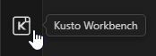

All of this is also available through the VS Code command pallete, so if you prefer a more minimal look, you can turn of the activity bar icon in the extension's settings.

### Import connections

Don't manually add every single Kusto cluster and database you work with. If you have been using Kusto either on the desktop or browser already, just import your existing connections.

1. In Kusto Explorer, export your saved connections as an XML file (commonly named `connections.xml`).
2. In VS Code, open the query editor and choose `Import from .xml file…` in the connection picker.

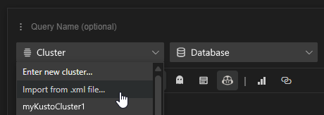

### Save connections to favorites

Save frequently used connections to favorites, with a friendly name so you can remind yourself what the connection is used for.
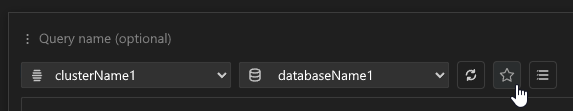

### VS Code custom agent that actually works

Just let the custom VS Code agent 'Kusto Workbench' do all your work. It's crazy how good this thing is. If you are having problems, make sure you have a really good model like Opus 4.5 selected. If it still doesn't work, report the issue and I'll fix it for you. I use this every day, if it doesn't work for you, just tell me!

### Modern Kusto editor using the official bits from Microsoft

Uses the official Microsoft Kusto editor ([GitHub](https://github.com/Azure/monaco-kusto)) so you will always have a reliable and robust Kusto editing experience and you'll get extra goodies on top that you won't get in the official clients (web or desktop).
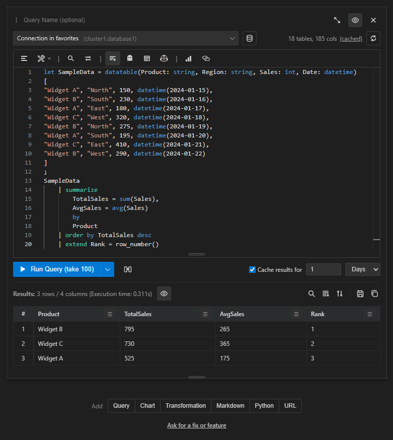

### Load .csv data directly from the internet

If you have a URL, then you can load it
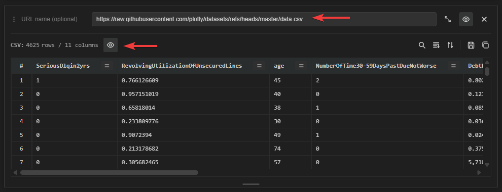

### Transform data

You can transform Kusto search results without changing the query itself. You can also transform .csv files loaded into the file by adding a 'URL' section.
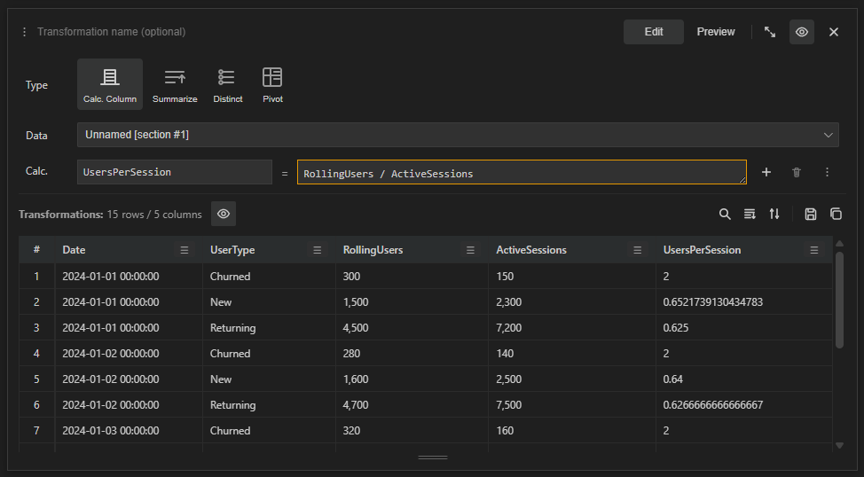

### Chart data

You can create charts from Kusto search results or .csv files loaded intot he file by adding a 'URL' section.
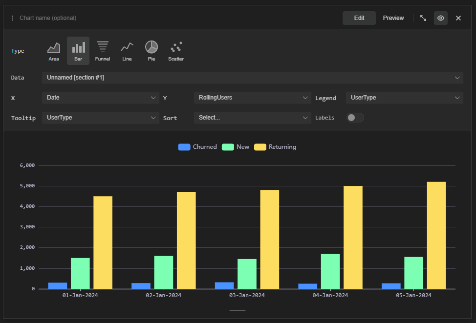

### Prettify query

Use the query toolbar “Prettify” action to apply Kusto-aware formatting rules (for example, improving layout around common operators such as `where` and `summarize`).
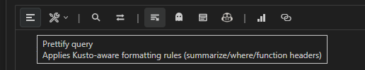

### Diagnostics and debugging

When a query fails, Kusto Workbench surfaces helpful, human-friendly diagnostics:

* Go-to-line behavior to take you straight to the relevant part of the query
* Highlighting of important terms to focus your attention with red squiggles
* Hints in the scrollbar

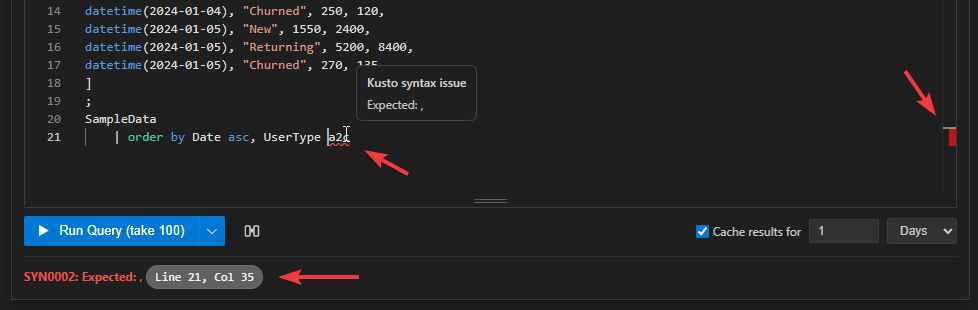

### Query comparison and performance optimization

If you have an existing query that you want to improve without changing its behavior and the results it returns, you can use the built in functionality to compare its performance and to guarantee that the data returned is identical, even if the rows and columns might be out of order.

### Create Azure Data Explorer links to share

It's always nice to be able to share a query using a hyperlink, and with this extension it's just a single click.

### Multi-account support

Some times we need to authenticate to different Kusto clusters with different identities, and this extension not only supports this scenario, but allows it even within a single file.

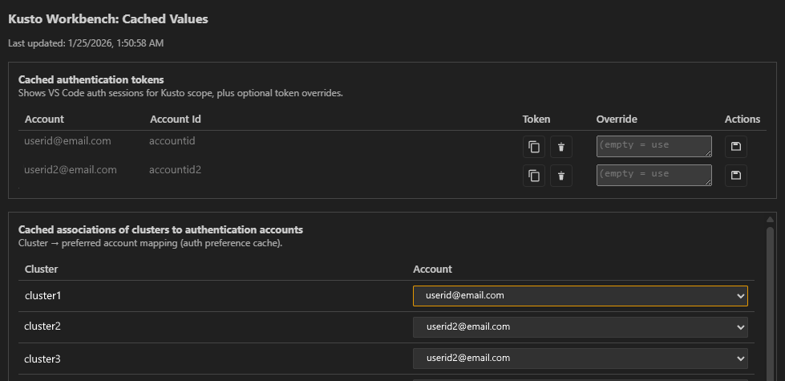

### Connection Manager and Cluster Explorer

Explore the Kusto clusters you have added connections to with ease. Browse the tables, functions and their definitions.

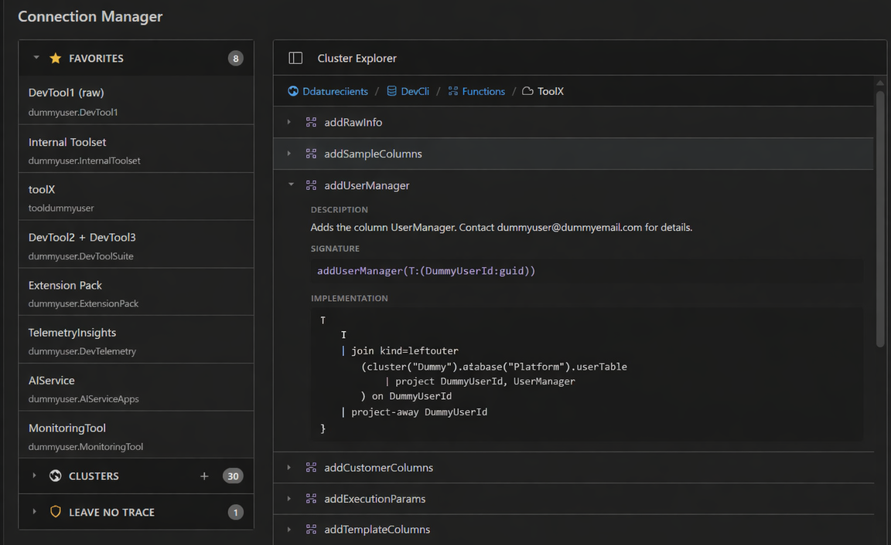

### Leave No Trace

Are you connecting to a Kusto cluster for which you should never export data or save data locally due to access restrictions, legal requirements, etc? Just flag the cluster and the extension will never save any of its data to disk, or even in temporary files. It will still allow you to save the queries and the chart settings, but the data itself will have to be retrieved each time you connect to the cluster.

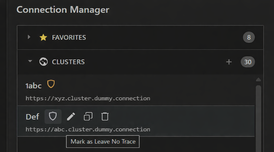

## Quick start

1. Open the Command Palette (`Ctrl+Shift+P`).
2. Run `Kusto Workbench: Open Query Editor`.
3. Add a connection, pick a database, and run a query.

To open a file:

* `.kql` / `.csl`: open it normally (opens in compatibility mode)
* `.kqlx`: create an empty file and open it normally, or run `Kusto Workbench: Open .kqlx File`
* `.mdx`: create an empty file and open it normally

## File formats (and “no file” mode)

### Open existing `.kql` and `.csl` files

You can open existing `.kql` and `.csl` files with no conversion. The file stays plain text, and saving writes back plain text. If you add more stuff to these type of files, you are asked to save a `.json` file with the same filename side-by-side.

### Create `.kqlx` files convinience

Use `.kqlx` and `.mdx` files to keep everything in a single file (.kql and .csl files require a sidecar .json file for some of the functionality)

### "No file" mode (persistent global session)

You don’t need to create a file to use the extension. Run `Kusto Workbench: Open Query Editor` and the extension opens a global, persistent session that auto-saves to a `.kqlx` file stored in VS Code’s global storage. This session is designed to survive VS Code restarts. If you want to turn that session into a real file in your workspace later, use `Kusto Workbench: Save Session As... (.kqlx)`.

### Open Remote File

You can open files directly from GitHub or Sharepoint using sharing or raw URLs using `Kusto Workbench: Open Remote File` from the command pallete or from the Quick Access panel off the Activity Bar icon.

## Commands

* `Kusto Workbench: Open Query Editor`
* `Kusto Workbench: Open Remote File`
* `Kusto Workbench: Open .kqlx File`
* `Kusto Workbench: Open .mdx File`
* `Kusto Workbench: Save Session As... (.kqlx)`
* `Kusto Workbench: Manage Connections`
* `Kusto Workbench: Delete All Connections`
* `Kusto Workbench: Show Cached Values`

## Requirements

* VS Code 1.107.0 or higher
* For Python sections: a local Python install available as `python`, `python3`, or `py` on your PATH

## Data & privacy (how it actually works)

This extension is designed to keep your work local by default, and only sends data to remote services when you explicitly run an action (run a query, optimize with Copilot, etc.).

### What gets stored locally

* **Connections**: Saved in VS Code extension global state on your machine (name + cluster URL + optional default database). This is not synced by the extension itself, but your VS Code settings/profile sync behavior may vary.
* **Authentication account preferences (per cluster)**: The extension remembers which Microsoft work account was last used successfully per Kusto cluster (account id/label only). This helps avoid repeated sign-in prompts when you use multiple clusters that require different accounts.
* **`.kqlx` notebooks**: Stored wherever you save them (workspace file), and contain your section content (queries, markdown text, python code/output, URL section settings, etc.).
* **Persistent “no file” session**: If you use `Kusto Workbench: Open Query Editor`, the session auto-saves to a `.kqlx` file in VS Code’s *global storage* for this extension so it can survive restarts.
* **Optional persisted query results**: When enabled/available, the extension may embed recent query results into the `.kqlx` state as JSON (capped at \~200KB per section). If you save a `.kqlx`, those embedded results become part of the file.
* **In-memory caches**: Database lists and schema information are cached in memory to speed up iteration. These caches expire and are not intended to be long-term storage.

### What gets sent to your Kusto cluster

When you click **Run** (or any action that executes KQL), the extension sends:

* Your **query text**
* The target **cluster** and **database**
* Your **Microsoft access token** (obtained via VS Code’s built-in Microsoft authentication)

The extension uses `vscode.authentication.getSession('microsoft', ['https://kusto.kusto.windows.net/.default'], …)` to acquire a token. Token lifecycle and secure storage are handled by VS Code; the extension uses the token in memory to authenticate requests.

If you work with multiple clusters that require different accounts, the extension will try previously-used accounts silently (without prompting) and will only prompt you to sign in when none of the known accounts work for the target cluster.

### What gets sent to GitHub Copilot

When you use **Optimize query performance**:

* The extension sends the optimization prompt (which includes your **query text**) to GitHub Copilot via VS Code’s Language Model API (`vscode.lm`).
* The extension does **not** send your Kusto credentials to Copilot.
* Any result comparison happens by running queries against your Kusto cluster (not by executing anything inside Copilot).

Important note: the prompt can be edited in the UI; anything you include there is part of what gets sent to Copilot.

### Python sections

Python sections run **locally** on your machine by spawning a local Python interpreter (`python`, `python3`, or `py`).

* Your code is executed locally.
* Output is captured (with size limits) and may be stored in the `.kqlx` file if you save.

### Diagnostics and logs

* Query errors returned by the Kusto SDK/cluster may be surfaced in the UI (and may include fragments of your query or server-provided diagnostics).
* The extension may write diagnostic information to the VS Code Developer Tools console during development/troubleshooting.

### How to remove stored data

* Remove saved connections: use `Kusto Workbench: Manage Connections`.
* Remove `.kqlx` content (including embedded results): delete or edit the `.kqlx` file.
* Clear the persistent session: delete the extension’s global storage for Kusto Workbench (this removes the auto-saved session file).

## Third-party credits

* Markdown section editing uses **TOAST UI Editor** (MIT) by NHN Cloud FE Development Lab: https://github.com/nhn/tui.editor

## License

[MIT](LICENSE)