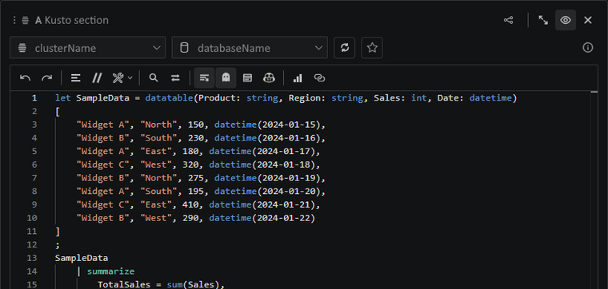

# The agent can build more than query sections

A good analysis rarely ends with one table. The agent can add chart sections for shape, markdown sections for narrative, transformations for derived views, and Python sections when local code is the right tool.

Try asking for the final artifact instead of the intermediate step: "create a notebook that explains this incident" usually gets you a richer result than "write a query".