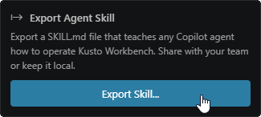

# You can teach another agent to control Kusto Workbench

If you use a custom agent outside this extension, export the Kusto Workbench skill. The generated skill explains how to create sections, run queries, configure charts, and inspect results through the extension tools.

This is a quiet power feature: it lets your own workflow-specific agent use Kusto Workbench as the execution surface instead of guessing from plain text alone.