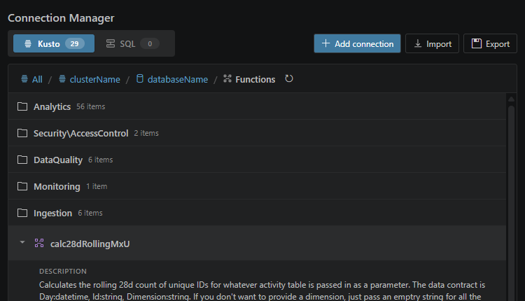

# The agent can search schemas across your saved connections

When you know the metric but not the table, let the agent search. Kusto Workbench keeps schema context for your connections, so the agent can look for likely tables, columns, and functions before it starts writing KQL.

This works best when you describe the business concept in plain language. Ask it to list candidate tables first when you want to review the trail before it runs anything expensive.