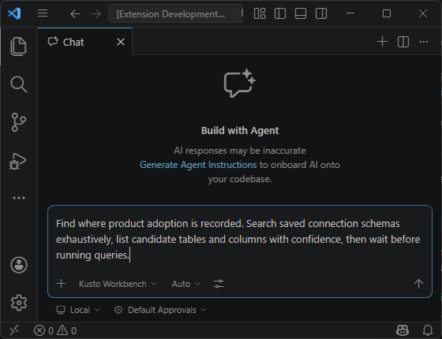

# The agent can kick off an exhaustive schema search

When you know the business concept but not the table or even the database / cluster, ask the Kusto Workbench agent to search broadly. It can inspect saved Kusto connection schemas and list the tables and columns most likely to hold the data you need.

