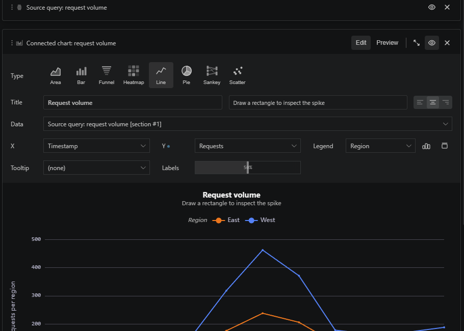

# Charts refresh when the source query re-runs

Charts stay connected to their source query section. Change the query, run it again, and the chart updates in place without rebuilding the visual. This makes chart sections useful while you are still exploring: tune filters, bin sizes, and summarization in KQL while the chart stays attached for comparison and confirmation.

 
