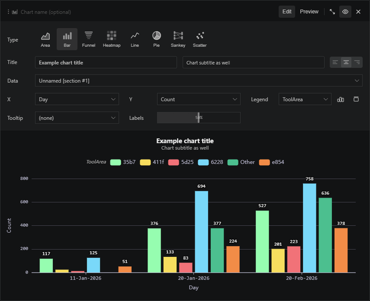

# A legend column can split one chart into many series

Use the legend setting when one metric needs to be compared across regions, versions, tenants, or any other dimension. The chart can turn a single result table into multiple series. Keep the legend cardinality small. If the chart grows too busy, summarize to the top values first and let the rest stay in the table.

 
