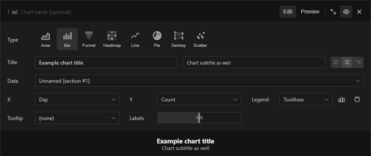

# Axis and legend labels are configuration entry points

Some chart settings are intentionally close to the thing they control. Click the X, Y, or Legend labels in the chart section to adjust how columns are mapped and displayed.

It is a small interaction, but it keeps the chart builder compact while still giving you the knobs you need for polished report visuals.