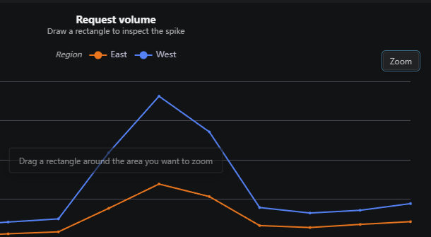

# Line, area, bar, and scatter charts support rectangle zoom

When a chart gets dense, use Zoom to draw a rectangle around the part you want to inspect. Kusto Workbench keeps the chart in place and narrows the visible X and Y ranges to your selection. Zoom is available on line, area, bar, and scatter charts. Use Undo zoom to step back through selections when you are done exploring a spike, cluster, or outlier.

 
