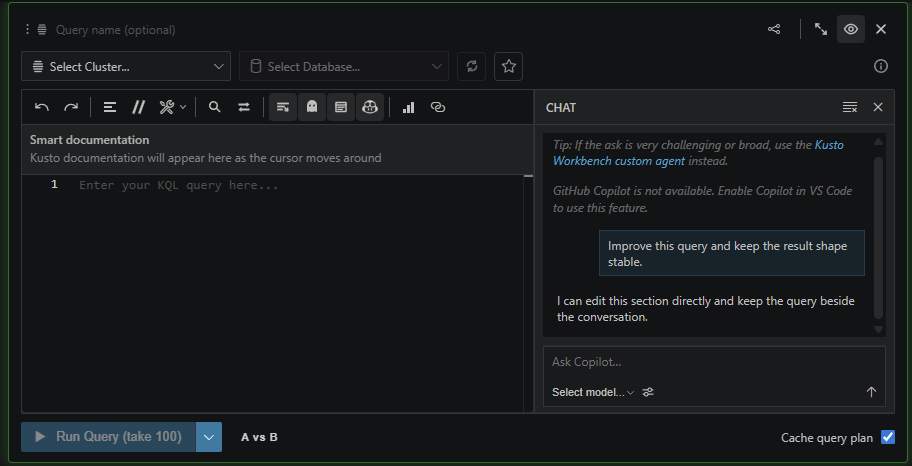

# Use section Copilot for surgery and the agent for orchestration

Section Copilot is best when you are editing one query with one database schema. It opens inside the section, keeps the query close by, and focuses on targeted changes.

The Kusto Workbench agent is better when the task spans multiple sections, charts, transformations, or databases.

The simple rule: ask Copilot to improve the current query; ask the agent to build or reshape the notebook. Or just always use the Kusto Workbench Agent for everything, that's also valid.