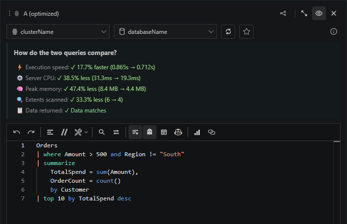

# Query optimization compares behavior, not just speed

The optimization flow is designed for confidence. It can compare performance and verify that the optimized query returns the same data, even when row or column order changes. You can use it manually, or ask Kusto Workbench agent to do it for you. Use this when you have a slow query that already works and you want to optimize.

 
