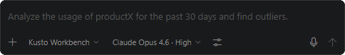

# Copilot can validate suggestions by executing queries

Integrated Copilot chat can use the selected query section and database context to run checks as part of its reasoning. You can see the tool calls and inspect what it tried.

Ask for verification explicitly when correctness matters: "run a small check first" or "show me why this join is safe" gives the model a better target than a one-shot answer.