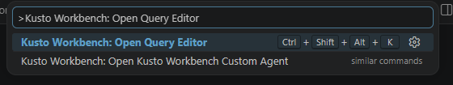

# The query editor opens from the Command Palette

Run **Kusto Workbench: Open Query Editor** when you want a quick KQL scratchpad without creating a file first. It opens the same notebook-style query section used by saved `.kqlx` workbooks. Use the scratchpad for quick checks, then save as a Kusto notebook when the query grows into analysis you want to keep.

