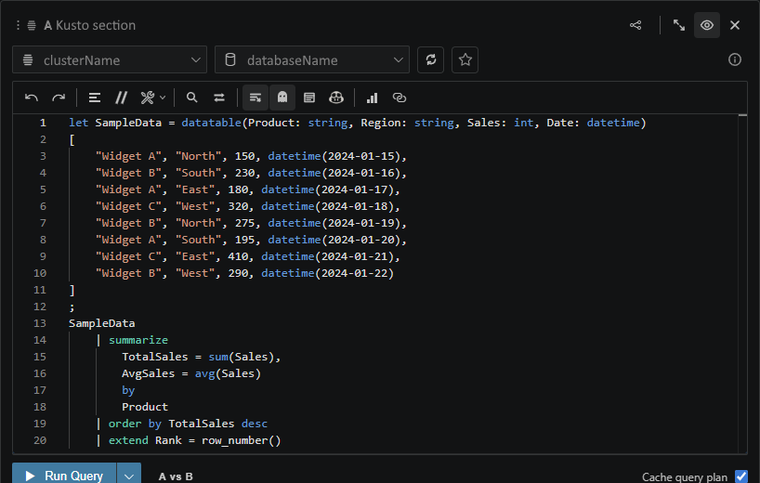

# You can run KQL from a scratchpad without creating a file

Open the query editor when you want to try KQL quickly without adding a new file to the workspace. It gives you a lightweight scratchpad with the same connection and execution tools.



```kusto
StormEvents
| take 10
```

Results appear inline below the query section, so you can validate shape, columns, and sample rows before deciding whether the work belongs in a saved `.kqlx` notebook.
