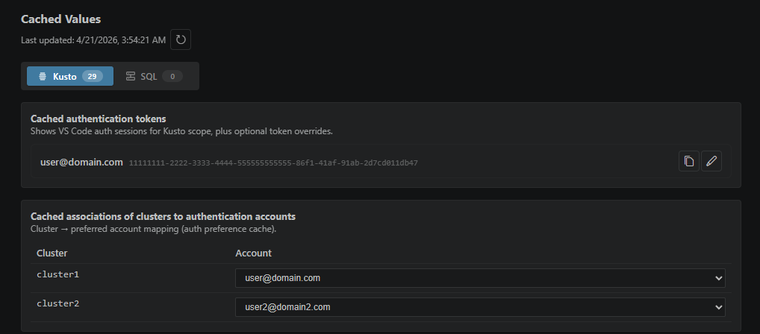

# Different clusters can use different accounts in one file

Kusto Workbench remembers the Microsoft work account that succeeds for each cluster. That means one notebook can talk to multiple clusters even when they require different identities.

This is easy to miss because the best version of it feels boring: fewer sign-in prompts, fewer accidental account swaps, and less ceremony when a workbook crosses team boundaries.