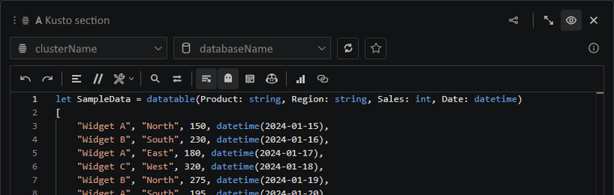

# Run modes help you avoid accidental full scans

The Run button has modes for quick iteration. Use `take 100` or `sample 100` while shaping a query, then switch to a full run only when you actually need the complete result set.

The selected mode is remembered per query section. That means an exploratory section can stay safely limited while a production check in the same notebook runs exactly as written.