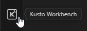

# The Activity Bar icon is a shortcut tray

The Kusto Workbench Activity Bar view gathers common commands in one place: open the query editor, manage connections, open remote files, launch tutorials, and more.

If you prefer a minimal VS Code window, you can hide the icon and still use the same commands from the command palette.