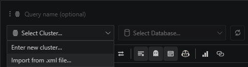
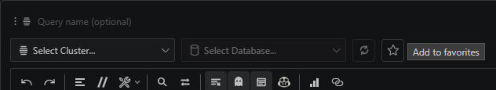

# You can import existing Kusto connections

If you already use Kusto Explorer, you do not need to recreate every cluster and database by hand. Export your saved connections as XML, then import that file from the connection picker.

After import, save your most common cluster and database pairs as favorites so future notebooks start faster.

