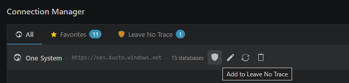

# Leave No Trace protects data that should not be persisted

Mark a cluster as Leave No Trace when query results should never be written into notebooks, temp files, or local caches. Queries and chart settings can still be saved; the data has to be retrieved again.

It is the setting to remember for restricted datasets, legal boundaries, or any source where a saved copy of the result would be the wrong kind of convenient.