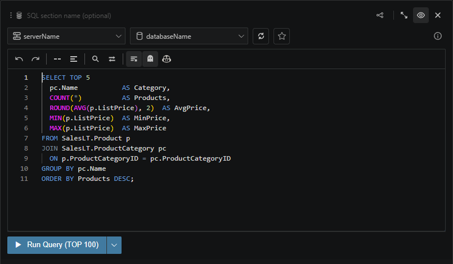
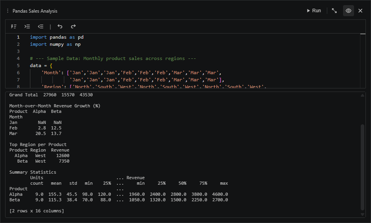

# Kusto notebooks can mix SQL, Python, and Markdown

Kusto Workbench is not only KQL. You can add SQL sections, local Python sections, and rich Markdown sections next to your Kusto queries when the analysis needs more than one tool.

Use Markdown to explain what the notebook is doing, Python for local post-processing, and SQL when another database belongs in the same story.