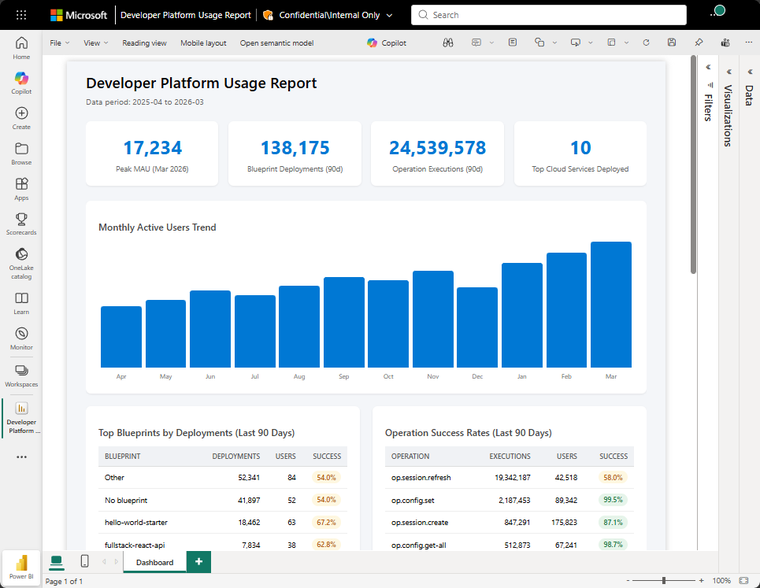

# You can build and publish a Power BI report

Start with query, chart, markdown, and HTML sections, then use the Power BI export or publish flow when the report is ready to share. The notebook remains the editable source while Power BI becomes the delivery surface.

This is useful when the work starts as investigation but ends as a recurring artifact. Keep iterating in Kusto Workbench until the report tells the story clearly.