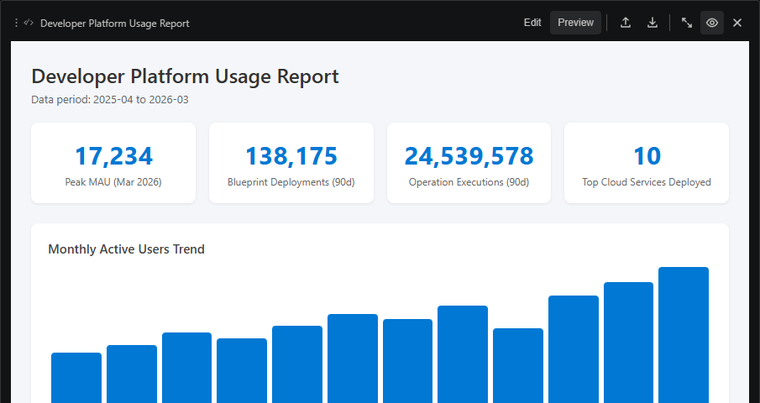

# Provenance blocks make dashboard values exportable

HTML dashboards can include a `kw-provenance` block and `data-kw-bind` targets. That tells Kusto Workbench which query result produced each dashboard value.

Without bindings, HTML is only a preview. With bindings, the export pipeline can turn scalars, tables, and charts into Power BI artifacts backed by the original data source.