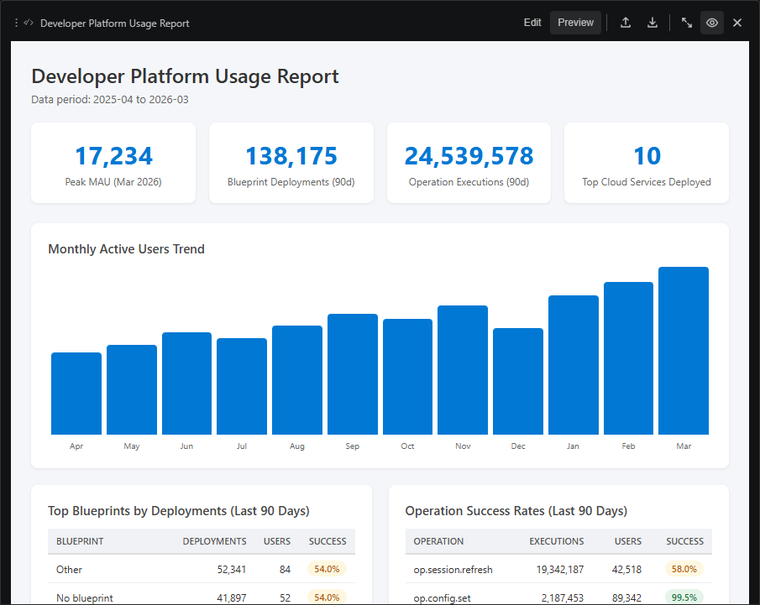

# You can publish to a Fabric workspace from the notebook

The publish flow can create or update Power BI items without making you leave VS Code. Pick the workspace, choose whether to update or create, and let Kusto Workbench package the report assets.

It keeps the authoring loop tight: edit the notebook, preview the dashboard, then publish the version you are ready to share.