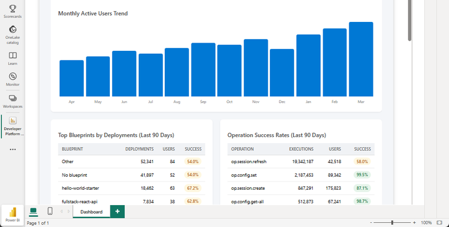

# Dashboard helpers can render exportable charts and tables

Use `KustoWorkbench.renderChart(bindingId)` and `KustoWorkbench.renderTable(bindingId)` when the preview and the Power BI export should agree. Repeated tables are available for grouped layouts too.

These helpers keep the dashboard interactive in the notebook while preserving a clean path into Power BI.