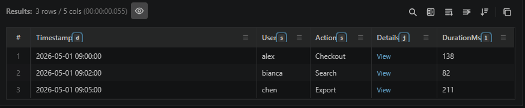

# Every result column tells you its datatype

Each column header carries a small glyph after the name: `s` for string, `d` for datetime, `l` for long, `j` for dynamic, and so on. Hover it and the tooltip spells out the declared type, such as **Data type: dynamic**.

It is the fastest way to tell a real number from a numeric-looking string before you sort, filter, or chart the column.
