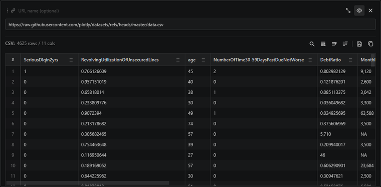

# Column headers have analysis tools hiding in plain sight

Right-click a result column header to sort, filter, inspect statistics, or list distinct values. You can answer a surprising number of follow-up questions without touching the KQL.

This is perfect for quick sanity checks: find the biggest value, confirm a dimension has the expected spread, or narrow the table before deciding whether the query itself needs to change.