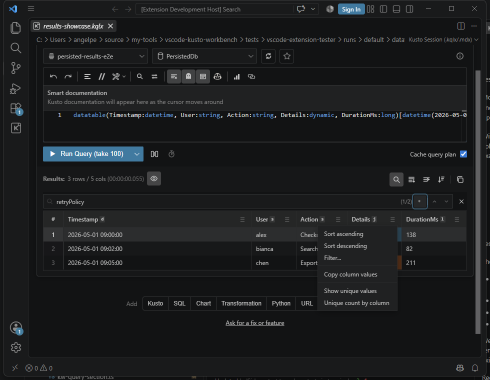

# Column headers have analysis tools

Typed result columns show a compact datatype glyph beside the header name; hover it to see the full declared type. Right-click the header to sort, filter, copy values, show unique values, or count unique values by another column.

This is perfect for quick sanity checks: confirm the schema, find the biggest value, inspect a dimension's spread, or narrow the table before changing the query.