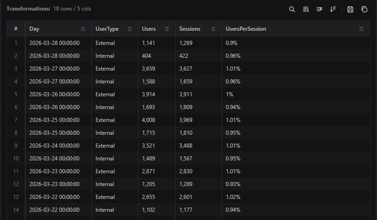

# Complex cells open in a viewer instead of staying cramped

Dynamic objects, arrays, and long cell values are hard to read in a grid. Double-click a cell to open a focused viewer with room to inspect and search the value.

This is especially useful for logs and telemetry payloads where the signal lives a few levels down inside a JSON object.