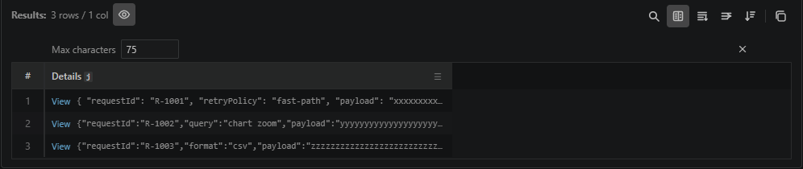

# Complex values can show configurable inline previews

Turn on **Preview complex values** in the results toolbar for a quick look inside JSON objects and dynamic arrays without opening each one.

**Max characters** widens or narrows the complex column, **View** still opens the same complete value, and table search highlights matches directly inside the preview.