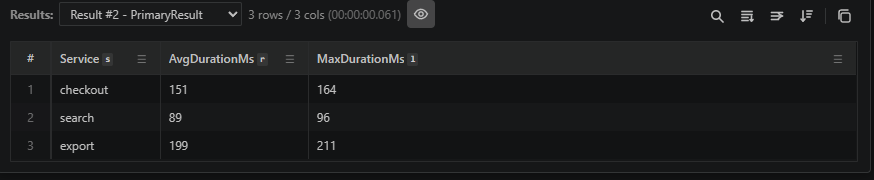

# One query section can keep every result of a multi-statement query

Pick **Run All** from the Run button menu and a query with several tabular statements keeps all of them. A result picker appears beside the row count so you can move between **Result #1**, **Result #2**, and the rest without rerunning anything.

The selected result is what charts, transformations, and saved files bind to, and it survives closing and reopening the notebook.
