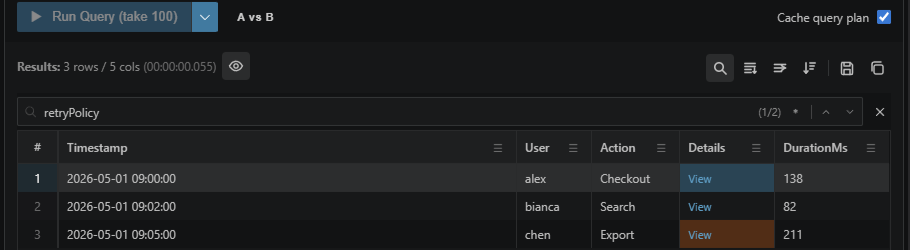

# Result search can find text inside JSON values

The results table search checks complex cell payloads, not just the text currently visible in the grid. When a match is inside a dynamic value, the cell is highlighted and still offers the View action for inspecting the full JSON.

Use wildcard mode for loose exploration and switch the search control to regex when you need precise matching.

