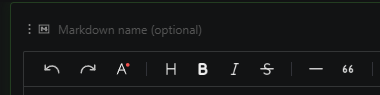
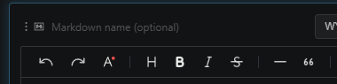

# Sections flash green (new) and blue (edited)

Sections flash when they are the currently selected editor, and they remain green or blue until the next time the file is saved. It is a small visual hint for what changed since the last save.

New sections flash green

Changed sections flash blue

If you come back to a notebook and wonder what is new, scan the corners first. The color usually tells you where to look.

 
