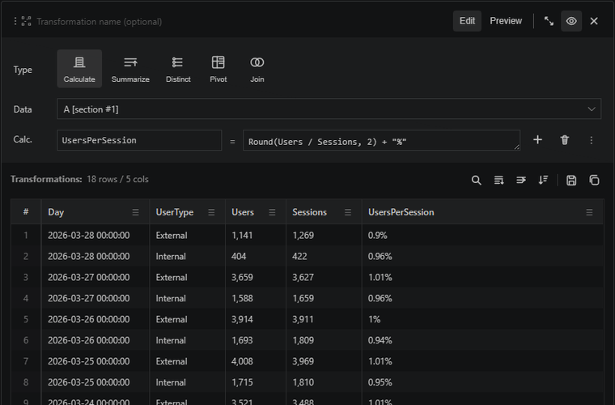

# Transformations do not re-run the Kusto queries

Transformation sections operate over cached result data. That means you can filter, project, summarize, pivot, or sort a result without sending the original Kusto query again.

Use them when you want a reusable derived view over a result set. The source query stays stable, and each transformation documents the next step in the analysis.
